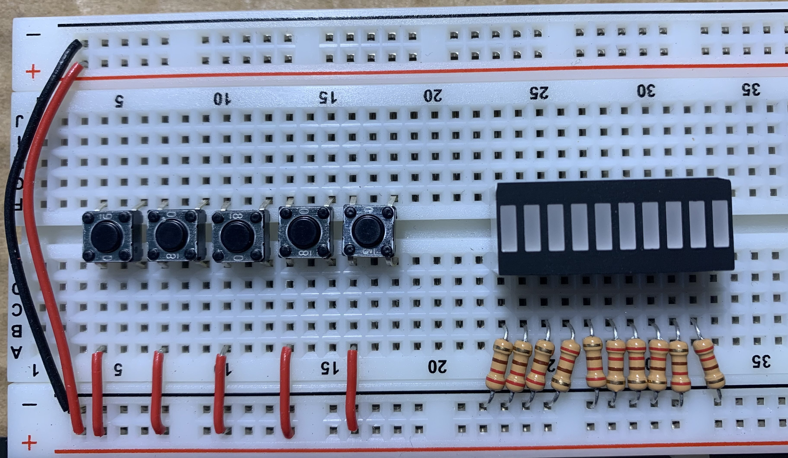

# Breadboard Computer v2

This project is related to building hardware more than a software project.  There will be some code added to this project later on for programming the firmware and downloading a program, but that will be in the final stages.

This project is inspired by [Ben Eater's Breadboard Computer](https://eater.net/8bit).  Currently as this get started, I have his computer nearly complete and I am working on the final connections and debugging before I get into the control logic.

## Why?

I have always liked playing with hardware but never had any place to learn about it.  I stumbled on Ben Eater's 8-bit breadboard computer and it really sparked my interest.

OK, so why not build that one and call it a day?  Well, I did.  Or more the the point, I am.  However, there are some things I think need to be improved on.  Many of these come from my software developer (dare I call myself a software engineer?  I probably shouldn't) experience.

While I am completing the original computer and debugging it, it really all came to a head when all the control lines started to get in the way.

Not only are they all crushed down to the board to get them out of the way, but several leads were breaking from being worked so hard.

And then, there is the whole "active low" vs. "active high" issue.  There are a number of control lines which are active low meaning as long as you are asserting a "true" or 1 on the line it means, "Do not load any value from the bus."  This inversion in an interface point flicks my OCD buttons!  Big time!

## Videos

Hey, I tried it.  I made a few videos.  I did not like them.  I do not have the polish that Ben Eater does; I do not have the tools Ben Eater does.  Let's face it: he set a high standard and I cannot compete.

That said, I am also quite good at documenting my progress in projects.  I typically spend just as much time documenting as I do actually working on the project.  It helps me think things through (and believe it or not saves me time overall).

So, my goal is not to write a teaching video as Ben Eater did.  My goal is to document my progress as I go for others to review and enjoy -- and maybe get some ideas.  If you learn something from my mistakes, that's fantastic, too!

## Formal Experience?

Am I an electrical engineer?  No.

Do I have an extensive background in electronics?  No.

Am I learning as I go?  Yes.

Have I made mistakes?  Absolutely.

In fact: my first attempt at Ben Eater's Clock Module actually cooked one of the 555 Timer ICs.  I had to go find and order a replacement.  While I was at it I orders several other things I figured I would "break" along the way.  Now I have quite the collection going -- enough to prototype somethings on separate boards.

## Schematics

I was able to find KiCAD, an open source schematic drawing software.  It has natively all the elements that will be used to construct this computer.

I will be adding these files into the `kicad` folder in this project.

## Common Interface

I am going to be pulling the interface points to the edges of each board and making each row consistent for several interface points.  Additionally, all interface points will be converted to be active high.  As a result I will need to add an inverter to nearly all modules to properly handle that signal on-module.  But the point is to keep that kind of messiness away from the other modules.  Also, there are several modules which will have an inverter already on the module with unused gates.

Here is a picture of the updated Clock Module with the *clock* (white) and *output to bus* (yellow) interface rows tied together on the right side of the board.

## Test Board

One of my goals is to be able to simplify testing of each module.  This is one of the driving reasons I am migrating to a common interface configuration.

To assist in this, I have created a test breadboard.  This board is intended to have all the inputs necessary to test the control lines and the outputs required to view the bus contents.  Here is a picture of this board:

The goal here is to quickly hook up wires and to be able to test the module functions more thoroughly before adding it into the final computer -- something I struggled to do with the original computer.

## 10-Segment LED Graph

I will replace the individual LEDs with a 10-segment LED graph for most modules (the most notable exception being the Clock Module).  These LED graphs have 8 green LED which will be used to represent data bits.  They also have an orange LED and a red LED which will be used to indicate reading data from the bus and writing data to the bus respectively.

With this change, the boards are able to get a higher density of LEDs and therefore a little more room on each board.  The drawback is that it will saturate the power rails for a section of the board and I may have to get creative when pulling power and ground to something else.

## Wire Colors

There are several color wires I plan to use -- a few more than Ben Eater used with the original computer.  These are:

| Color | Used for |
|:-----:|:---------|
| Red   | +5V or tied high |
| Black | Ground or tied low |
| White | Clock signal (regular or inverted) |
| Yellow | Control Lines |
| Blue | Data bus lines |
| Purple | Address lines |
| Green | Connections on-module |
| Brown | Manually input data and/or Arduino interface |
| Grey | Data Output (such as LED) and other connections not listed above |

## Modules

### Clock Module

The Clock Module is slightly modified version of [Ben Eater's Clock Module](https://eater.net/8bit/clock).  The schematic of his module is referenced below.

The changes I am making to this module are:
1. Place yellow LED indicators on the astable and monostable timer circuits for visibility.
1. Place a green LED indicator on the switched circuit to show when the clock is in run mode (vs. single-step mode).
1. Add a red LED to indicate when the clock is halted by the control lines (the `HLT` signal).
1. Remove the inverted `CLK'` signal, which will be relocated to the Control Module where it is consumed.
1. Remove the OR gate and replace it with inverters and an AND gate (`A | B == (A' & B')'`).  See [2022-Jan-22 in the Journal](journals/Journal-01-Clock.md#2022-Jan-22) for a discussion and proof.
1. I am adding current-limiting resistors to every LED.  To be fair, Ben Eater's kits and instructions say that this is optional even though he does not use them in the videos.

### Program Counter Module

The Program Counter is nearly the same as [Ben Eater's version](https://eater.net/8bit/pc).  The original Program Counter is referenced below:

Simply put, the changes the improved Program Counter are:
1. Make it a full 16-bits wide.
1. Since this is an 8-bit bus, make an upper and lower register, tied together.
1. There are 4 74LS161 counters tied together.
1. The original Program Counter had a bad habit of counting when it wasn't supposed to (on my boards anyway).  The improved Program Counter has a 100Ω pull-down resistor across Pin 2 of the lowest nibble 74LS161.
1. I use a 10-bar LED graph to indicate the data and control logic.  There are 8 green data LEDs, 1 yellow LED to indicate input from the bus, and 1 red LED to indicate output to the bus.  There is 1 graph for the upper Program Counter and another for the Lower Program Counter.
1. A 74LS04 Inverter was added to that the Control signals are inverted "locally" when required.  4 of the 6 inverters are utilized.

### Power-Up Reset / Zero Register Module

Ben Eater did not have this feature in the original computer.  The original computer had a reset button to clear everything on after manually programming.  I also plan to have a reset button, but I do not want to have to manually "reset" the computer on power up.

The reset button is tied into the power-up logic, not the Control Logic in the original computer.  The original computer's reset button can be seen [here](https://eater.net/schematics/control.png) in the bottom left corner of this schematic.

I also had problems getting the pull-down resistors to work properly on the bus.  Instead of pulling the bus values to 0, it left them floating.  I was not smart enough to figure out what the problem was, much less how to fix it (using the pull-down resistors anyway).  From the videos, I was not able to determine how this was tested.

Instead I made sure that every line was output to the bus even when there were only 4 bits to output (I tied the unassigned 4 bits low).  This cleaned up my problems.

In the improved version, I am going to add a Zero Register.  This register will output a 16-bit zero value on the bus and will be the default output register to the bus when nothing else is being output.

The Zero-Register is not really a register (more like a hard-coded zero value) and as such cannot be updated.

Since I have plenty of room on the Power-Up Module and the Zero Register will be placed on this board as well.  I am going to have plenty of boards.

### General Registers

There are 8 basic registers that are included in this updated computer, not counting the Program Counter.  These are:
* A Register (Software accessible)
* B Register (Software accessible)
* X Register (Software accessible)
* Stack Register (Software accessible)
* Output Register (Write only; Software accessible)
* Memory Address Register (MAR)
* Memory Index Register  (MIR)
* Temporary Register (TR)

Some of these registers will have components added on.  For example, the MAR and MIR will always be added together to come up with the proper Memory Address.

## Control Signals

It occurs to me early on that I need to keep track of the control signals I am requiring, and what module they are associated with.

| ## | Module          | Control Signal      |
|:--:|:---------------:|:-------------------:|
| 1  | Clock           | Halt                |
| 2  | Program Counter | Clear               |
| 3  | Program Counter | Enable              |
| 4  | Program Counter | Upper Byte In (JMP) |
| 5  | Program Counter | Upper Byte Out      |
| 6  | Program Counter | Lower Byte In (JMP) |
| 7  | Program Counter | Lower Byte Out      |
| 8  | Power-Up Reset  | Zero Register Out   |