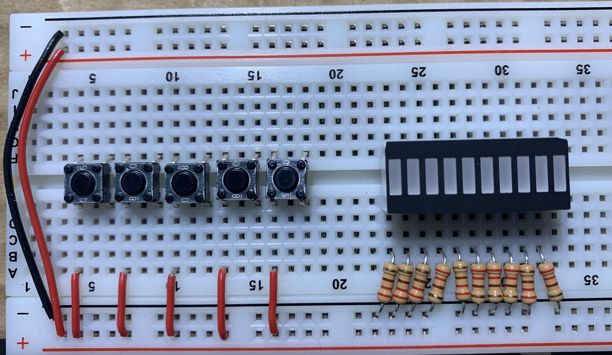
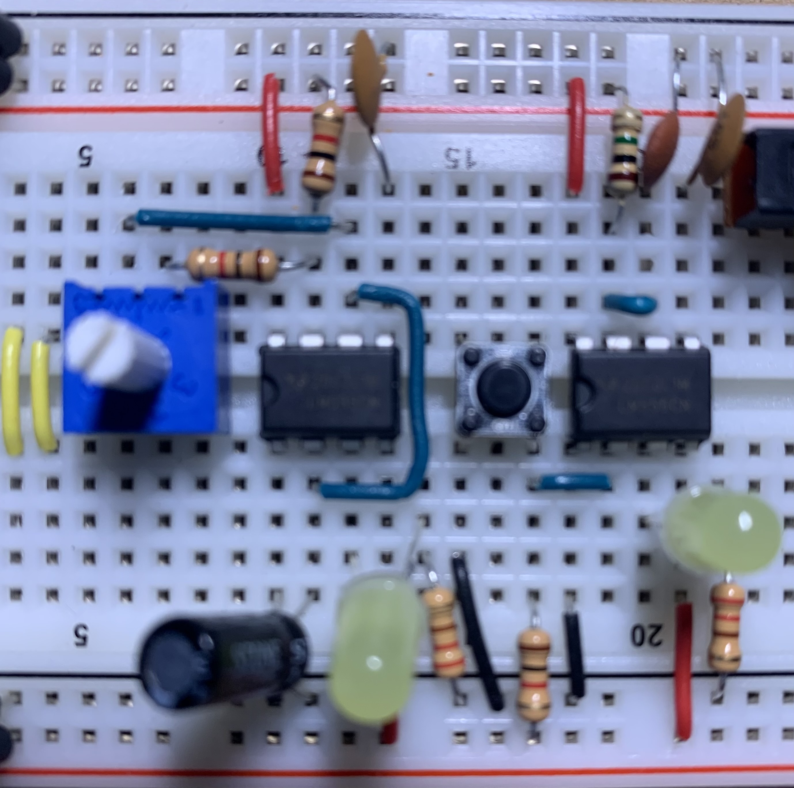
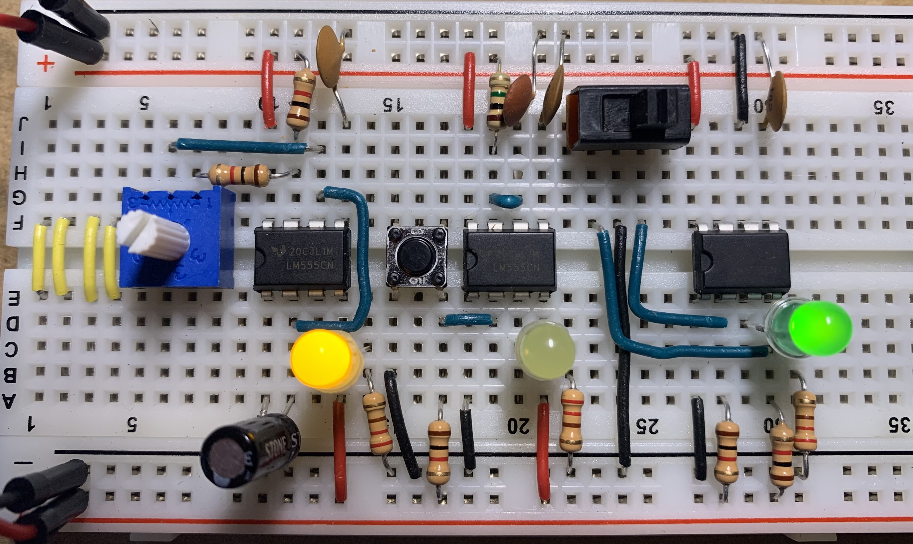
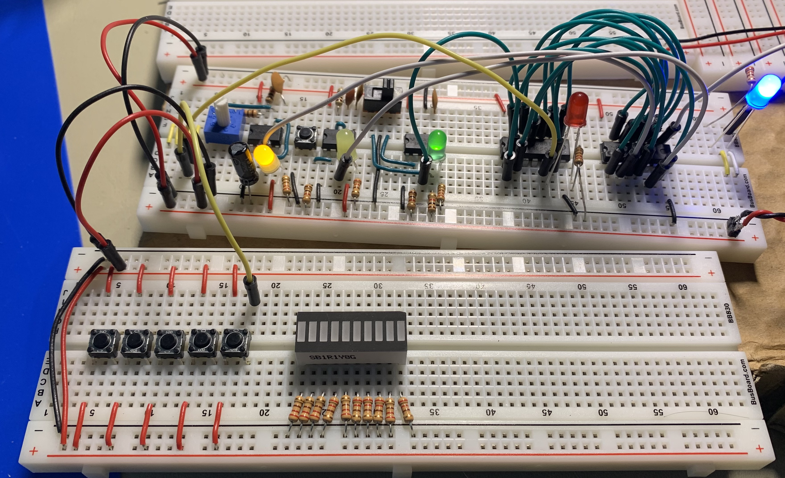
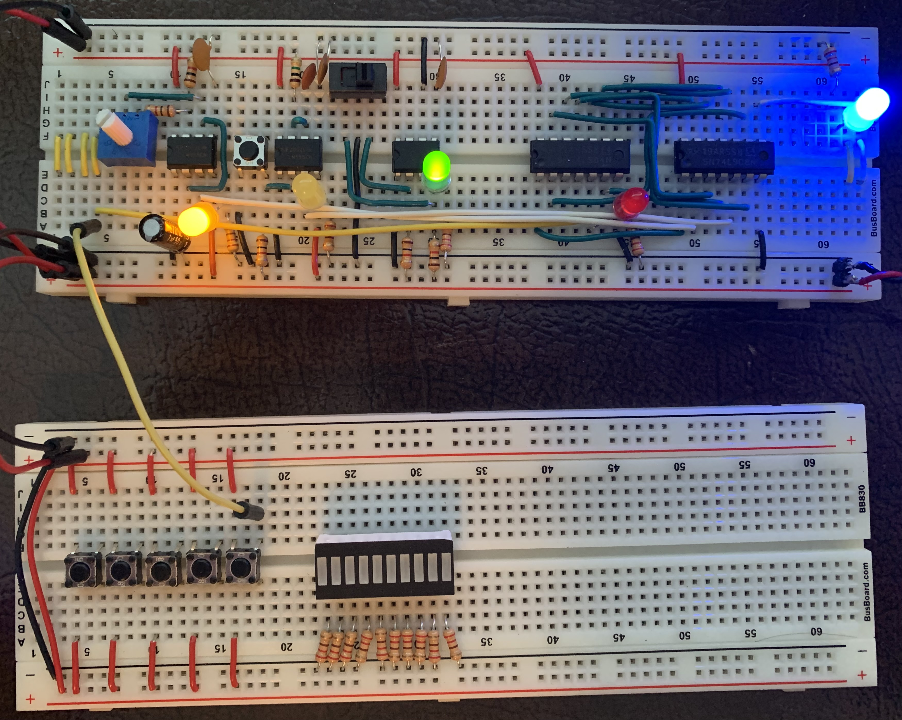
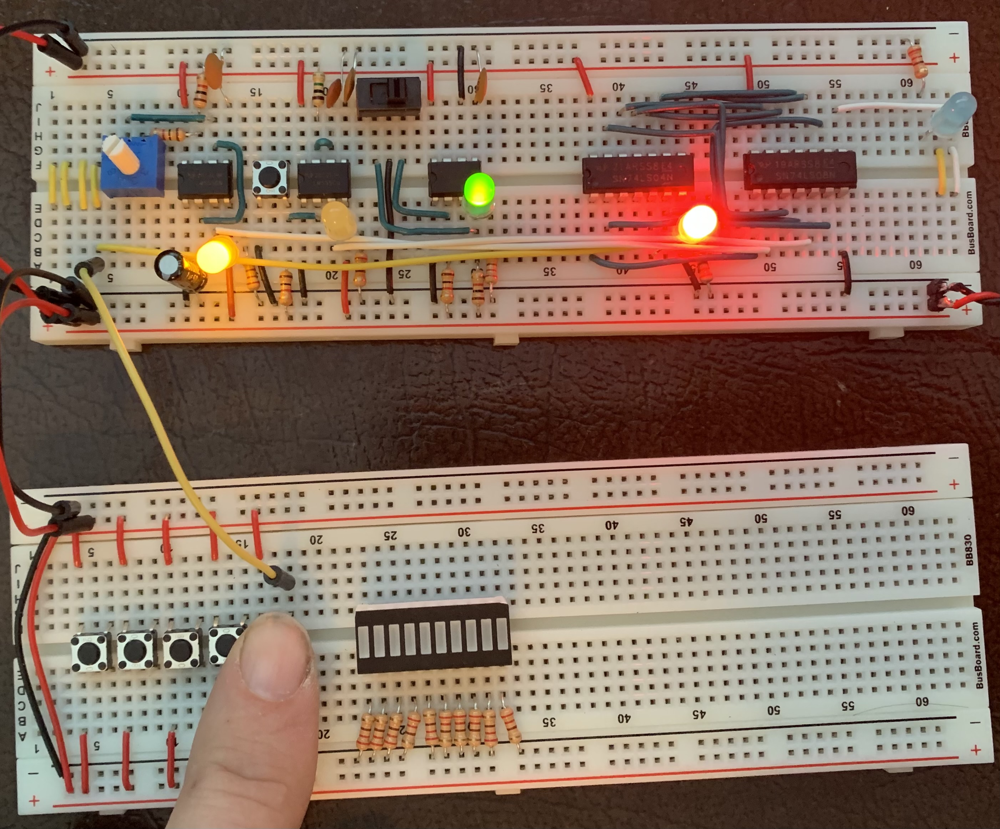
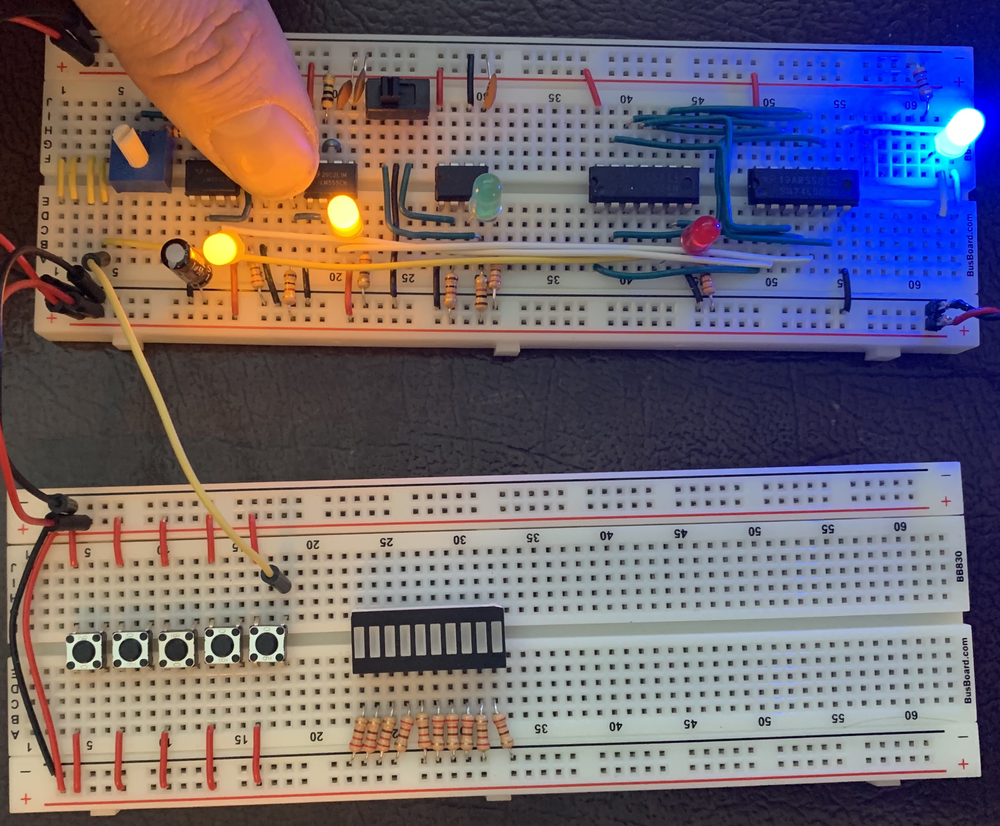
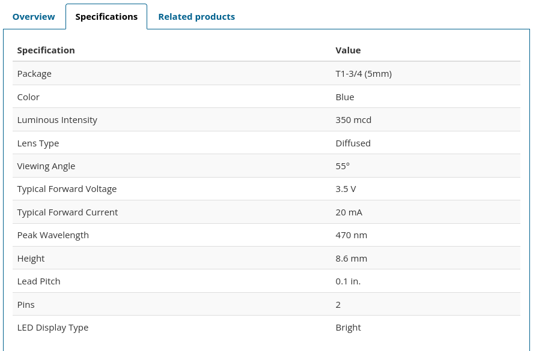
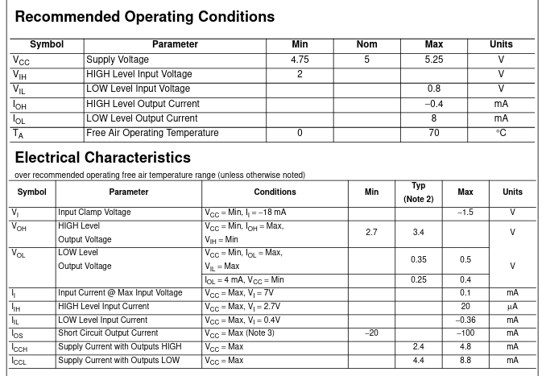
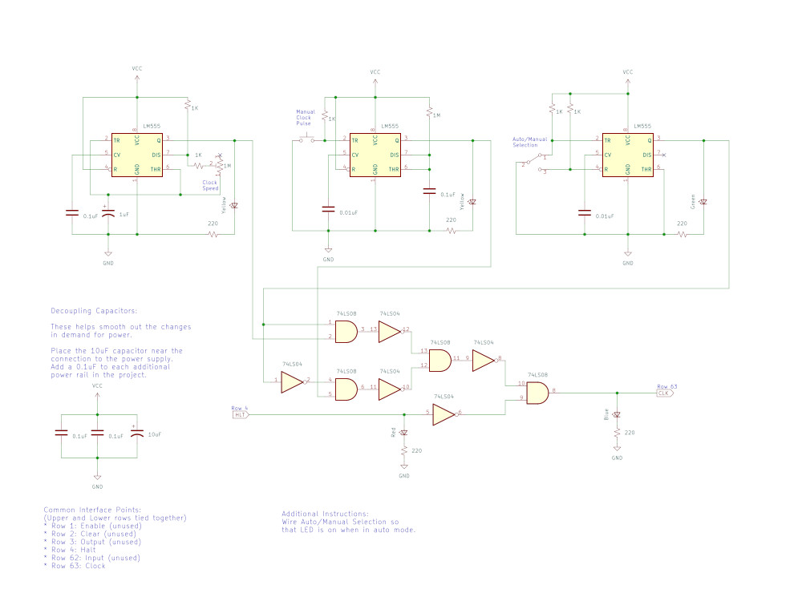

# Breadboard Computer v2

This project is related to building hardware more than a software project.  There will be some code added to this project later on for programming the firmware and downloading a program, but that will be in the final stages.

This project is inspired by [Ben Eater's Breadboard Computer](https://eater.net/8bit).  Currently as this get started, I have his computer nearly complete and I am working on the final connections and debugging before I get into the control logic.

As usual with my personal projects, I am compelled to keep a journal of this progress.  As usual with my journals, I will not go back and edit anything historical as these are my continuing thoughts rather than documentation of the final product.

## Clock Module

The first module to build is the Clock Module.  It will be required for nearly every other module that will be built.

---

### 2022-Jan-21

I got started with a second Clock Module today.  I started with the bi-stable timer.  It was not working (or so I thought) until I realized I ordered 10K Ohm variable resistors instead of 1M Ohm ones.

---

### 2022-Jan-22

OK, so I admit I am starting this Journal today.  I back-dated yesterday's entry since that was what I worked on yesterday and overnight I decided to create this Journal.

Today, after getting the Journal started, I worked on a board for testing.  Part of this was done yesterday and I completed it today.  Here is a picture of the near-complete board:

This test board was built on a BB830 breadboard.  However, today I ordered several BB400 breadboards and will migrate this to the new smaller board when they arrive.

---

For the Clock Module (Clock or Timer?  They are "timer" Integrated Circuits, but the intended output is a regular clock signal, so I am going to refer to it as a Clock Module), I ordered the replacement potentiometer (or variable resistor) today.  Well, a number of them.  I can pull the original one if I need to test something, but I will likely be working and documenting as much as I can before they arrive.

I also have plenty still to do for the original computer.

---

Before I go there, the Clock Module has a 74LS32 OR-gate used.  Only 1 OR gate.

I think I recall from my Boolean Algebra that I can replace OR logic with inverted inputs with AND logic.  Something like this:

`A | B = (A' & B')'`

So, let's set up a truth table to see if I am lying.

| A | B | A' | B' | A' & B' | (A' & B')' |
|:-:|:-:|:--:|:--:|:-------:|:----------:|
| 0 | 0 | 1  | 1  | 1       | 0          |
| 0 | 1 | 1  | 0  | 0       | 1          |
| 1 | 0 | 0  | 1  | 0       | 1          |
| 1 | 1 | 0  | 0  | 0       | 1          |

So, I can replace the single OR gate with 3 additional NOT (inverters) and 1 additional AND gate.

The 74LS08 is a Quad-AND gate IC.  I am using 3 of the 4 currently, so there is 1 available.  I need 1 and this will use the entire capacity of this chip.  Nice and efficient.

The 74LS04 is a Hex-Inverter IC.  I will be using 2.

***Note:*** *Ben Eater's Clock Module also outputs the inverse of the clock signal which is used only by the Control Module.  My plan is to invert this signal on the Control Module since it will better be represented by the Common Interface I am planning to put forward.  This plan saves me an inverter and a long signal line around the boards.*

This will leave 4 available inverters.  I need 3 inverters for this changed logic, leaving 1 unused gate.

Overall this change saves me 1 IC chip.  This feels like an appropriate improvement, since the power will be a concern with the number of chips in this computer.

---

I wired up the monostable (de-bounced) circuit on the new Clock Module.  They are not yet connected so the circuits work independently.  Here is the progress so far:

The LED lights are there to indicate the clock pulse for each circuit and will remain on the final board.

---

I now have all 3 timer circuits built.  They are not connected yet.  This (generally speaking) is all the analog circuitry that will be built into the computer (with the exception of the output display).

The 3 LED lights are (from left to right):
* The astable timer (flickering quite fast since I still have the incorrect variable resistor).
* The monostable timer, activated by the push button to the left.
* A green LED to indicate that the timer is in run mode.

The next step will be to hook up the logic circuits to output the correct clock signal and halt the clock with the proper control signal.

Connecting the logic was quick for a temporary wire-up.  The Clock Module tests out properly.  The sliding switch properly selects between the astable and monostable timer circuits, with the green LED on when the Clock Module is in run mode.

This is a very successful test and the only thing left at this point is to replace all the temporary wires with proper cut-to-length wires and clean up the LED and resistor lengths.

---

Now that it is all cleaned up, here is the board:

I am able to halt the clock.  Notice the interface point has been extended to the proper location on the board (the yellow wire).

Also, with the Clock Module in single-pulse mode (the sliding switch now to the left), I am able to manually trigger a clock pulse.

---

This actually completes the updated Clock Module.  These updates accomplish the following:
1. Remove an IC and better utilize the remaining ICs.
2. Create Common Interface Points on the module, which will match every other module built.
3. Added some additional indicator lights for the module state, including halted by the Control Logic.

I also added a current-limiting resistor to the blue LED which is driven from the 74LS08.  Ben Eater does not use them in the videos.  I will.  I have burnt a few LEDs and ICs.

That said, the LED specs state that the current forward is 20mA and the voltage forward is 3.5V.

The data sheet for the 74LS08 states the max output current (IOH) is 0.4mA.

0.4mA is certainly less than the LED's limit of 20mA.

Now, this is not to say that I have read and interpreted all these data points properly.  In fact, I would bet I have not.  I never claimed to be a professional.  Or an expert.  I'll use the resistors, thank you very much.

---

### 2022-Jan-23

After the first commit, I decided to separate my journals into each module and place them into a separate folder.  As a result, I had several links to clean up.

---

I was able to find KiCAD, which is open source.  I downloaded version 6.0.1 and installed it on my system.

From there I was able to create a schematic of the Clock Module and export that to a .jpg as well.  Here is the result:

The base schematic is the same as the original.  I was specific about which LEDs I added and added instructions on how to set up the common interface points.

---

### 2022-Jan-24

I did find some errors in the schematic (things like connections not completed).  I cleaned those up today and re-published the above image.  That said, I also had to update my naming convention so I can keep them separate.

