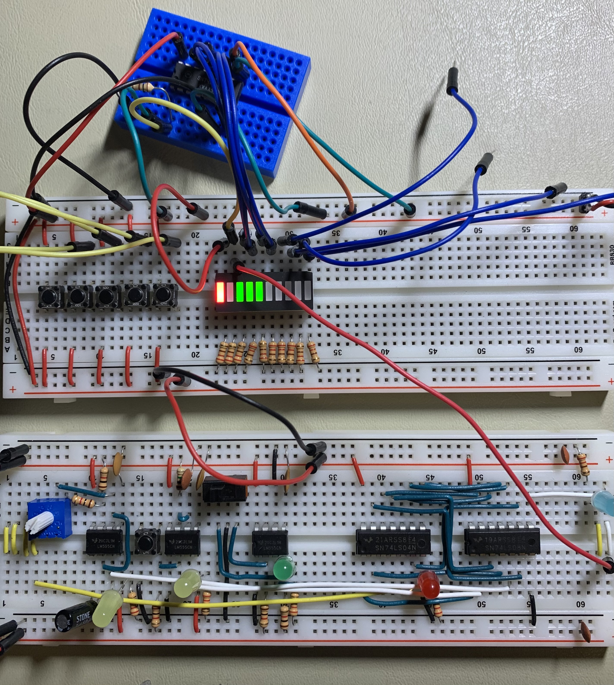
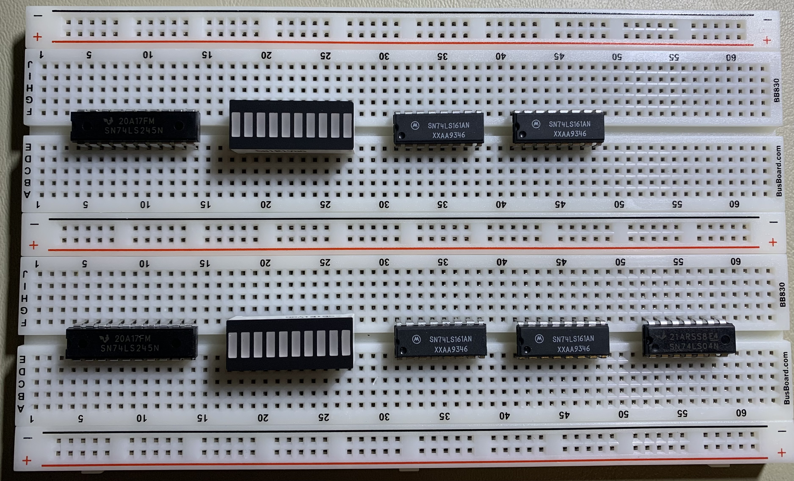
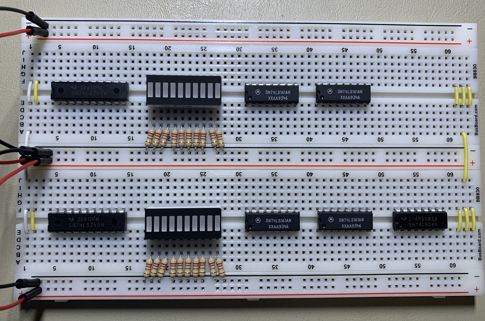
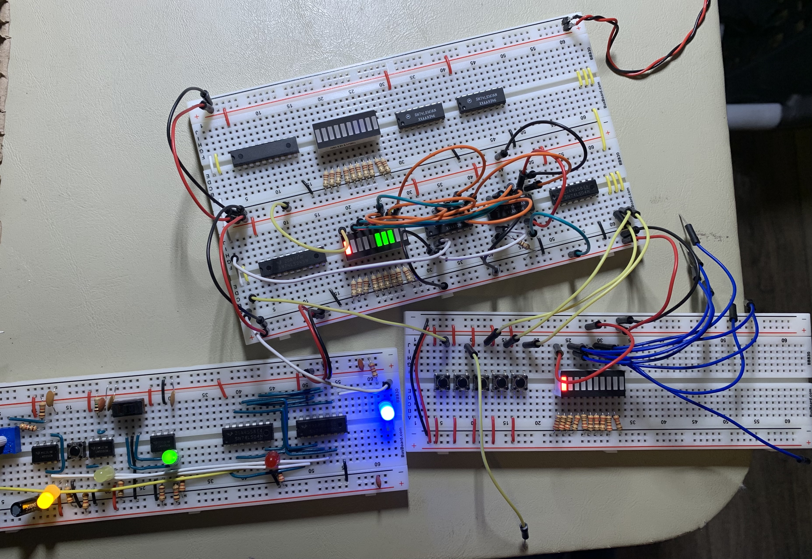
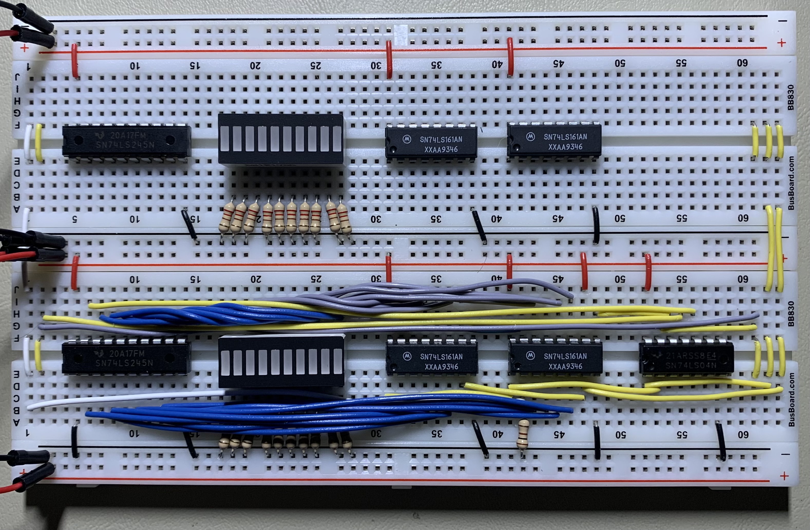
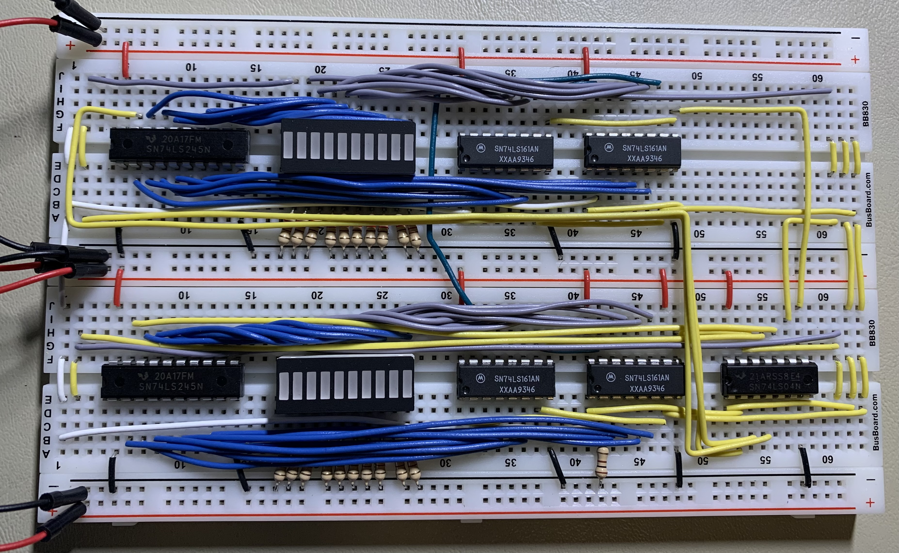
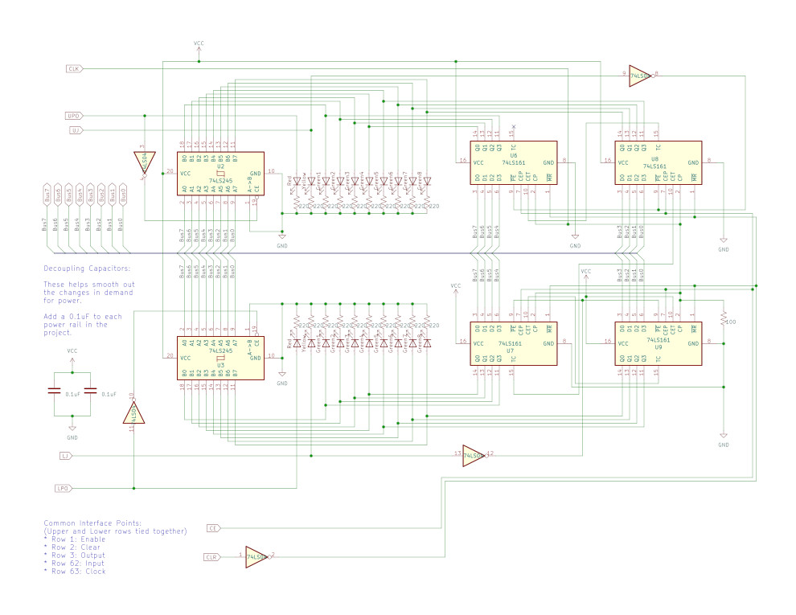

# Breadboard Computer v2

This project is related to building hardware more than a software project.  There will be some code added to this project later on for programming the firmware and downloading a program, but that will be in the final stages.

This project is inspired by [Ben Eater's Breadboard Computer](https://eater.net/8bit).  Currently as this get started, I have his computer nearly complete and I am working on the final connections and debugging before I get into the control logic.

As usual with my personal projects, I am compelled to keep a journal of this progress.  As usual with my journals, I will not go back and edit anything historical as these are my continuing thoughts rather than documentation of the final product.

## Program Counter Module

The next module to build will be the Program Counter Module.  This module will have a 16-bit counter (compared to the 4-bit counter in the original computer).

---

### 2022-Jan-23

Now is as good a time as any to get into a conversation about having 16-bit registers and an 8-bit bus.  This means I am going to have to handle moving data in 2 cycles for any given 16-bit move.  Effectively every 16-bit register will be handled as 2 8-bit registers.

Now, consider for example the need to move a new value into the Memory Address Register from Memory or a new value into the Program Counter from a Program Counter offset (i.e.: an immediate address value).  In both of those cases, the register providing the base address gets corrupted before the instruction can be completed.

To get around this concern, this computer will require a Temporary Register to assemble values for the Program Counter and the Memory Address Register.  Once the value is assembled properly, the Temporary Register can be copies (2 clock cycles) into the target register without corrupting its value during the critical load phase.

Therefore, all registers (including the Program Counter, since it is nothing more than a special-purpose register) are going to need to interact with the bus in 2 parts: the upper half and the lower half.

I looked, and there is no 74LS* 16-bit binary counter.  There isn't even an 8-bit binary counter.  The only thing I have to work with is a 4-bit binary counter (74LS161).  I am going to need 4 of them and I have none in stock.  It will be a week or two before I can get more.

Now, at some point in the future, I may convert this computer into something with a 16-bit bus.  When I do, I will have the ability to connect the 2 halves of the 16-bit register into separate halves of the bit and then redo the microcode to output both halves at the same time.

I'm bouncing around a bit today, but I get that luxury in my journals.

---

### 2022-Jan-24

Digging a little more into what the Program Counter requires (all lifted from the original computer), there are the following basic requirements (apart from the fundamental counting requirement):
* Enable/Disable the counter from the Control Module
* Able to jump to an address on the bus
* Reset the Program Counter on reset or power up
* Output the Program Counter to the bus
* The Program Counter will also make use of the Clock

Taking each of these in turn for a design discussion:

**Enable/Disable the Counter**

The Enable Common Interface line will be used to enable the counter.  It wll be handled by the Control Module in the final computer.  Both the upper and lower board will be tied together with the same Enable Control Line -- allowing all 16 bits to be counted.

This is an active high signal and will be routed to Pin 10 of the least significant nibble (EnableT).  EnableP will be tied high for all chips.

The Ripple Carry Output (Pin 15) will be carried into the EnableT for the next most significant nibble.

**Jump to an address on the bus**

This will have to happen in 2 cycles -- 1 for the lower byte and one for the upper byte.  As a result the source of the jump target will need to be built in and sourced from the either the Memory Address Register or the Temporary Register, depending on the instruction requirements.  This will be controlled by the Input Control Line from the Control Module.

This is an Active Low signal, so a 74LS04 Inverter will be required to properly prepare this signal for use.

**Clear on Power Up or Reset**

The Clear Common Interface point will be asserted on Reset or on initial power up.  The purpose is to reset all the 74LS161 chips to 0.  Both the Upper and Lower Modules will be tied together with a single Clear signal.

This is an Active Low signal, so a 74LS04 Inverter will be required to properly prepare this signal.

**Output the Program Counter to the Bus**

This will use the Output Control Common Interface line.  It will output either the lower byte or the upper byte to the bus.

The 74LS245 Transceiver is bidirectional, so it can move A->B or B->A.  I was hoping I would be able to eliminate 1 chip.  However, it looks like I will not be able to do that with the 74LS245 alone; additional chips would be required to separate the connections.  As this point, the 74LS245 is the better option.  I may revisit this if I get a spark of inspiration.

In the meantime, the 74LS245 has an Active Low enable line, so a 74LS04 Inverter will be needed to properly prepare the signal.

**Clock**

The Clock signal will be an input into this module.  It's signal will drive when the counter increments.  It will need to be routed to all chips.

---

The component count then is as follows:
* 4 X 74LS161 (8 pins wide)
* 2 X 74LS245 (10 pins wide)
* 2 X 10-bar LED graph (10 pins wide)
* 1 X 74LS04 (8 pins wide)

This is a very doable layout for 2 breadboards.  It will not be overly dense.

---

### 2022-Jan-26

Well, I had a problem with the original breadboard computer.  The problem is relevant here.  The situation was that the counters were counting when they shouldn't (i.e. the clock was in manual pulse mode), particularly the Program Counter.

I pulled the 74LS161 chip off and set up a dedicated test.  The problem was that somehow the clock line was picking up some noise and would force the 74LS161 to count even if the clock was switched to manual mode.  To make matters worse, the diagnostic tools did not work:
* The logic probe would not pick up any sort of pulse.
* The voltage meter would not show any kind of voltage.
* The oscillator when hooked up to measure it would eliminate the rogue signal.

Finally, I was able to determine that a 100Ω pull-down resistor across Pin 2 of the 74LS161 fixed the problem.  It would not work if it was placed on the clock module -- it had to be at the 74LS161.

I am running a test while I am writing this up, but things look promising on this front.  This is also something I will need to take into account for this design as well.

In the meantime, if you look closely at the blue breadboard, you will see a resistor stuck in there for testing purposes.

---

I did manage to get a dry layout today for the Program Counter:

From left to right on the bottom board:
* 74LS245 (Buffer)
* 10-LED graph
* 74LS161 (4-bit counter)
* 74LS161 (4-bit counter)
* 74LS04 (Inverter)

The top board mimics the bottom with the exception of the 74LS04 Inverter.

This module will appear in the top-right corner of the layout overall.  Therefore, the buffer (and the bus) will be on the left of the module.  This means the clock lines appear on the left.

The layout is really just a little tighter than I wanted.  But the LED graph makes up for it a bit -- those would be twice as wide with regular 3mm LEDs.

I also calculate that I need to use 5 of the 6 inverters:
* Clear (will drive all 4 74LS161 ICs with 1 signal)
* Upper Load (JMP)
* Lower Load (JMP)
* Upper Output (for Instruction Register load)
* Lower Output (for Instruction Register load)

Now, I cannot get over whether I can use a single 74LS245 IC for both bus outputs.  I could but I would also need to replace 1 74LS245 with 2 74LS157 chips.  That is not a good trade-up.  At this point, I am not going to pursue getting fancy with it.  Whatever I do will probably end up costing me more ICs than the current layout.

---

### 2022-Jan-27

I realized that I had my personal notes incongruent with the [Readme.md](../Readme.md), and my own notes were not correct.  I updated my notes to match this project documentation.

I was able to get a couple things done on the Program Counter throughout part of the day today.  I started with seating all the ICs and wiring up the common interfaces.  Both the clock and the clear signals are bridged across power for the entire module.  I also added all the current-limiting resistors for the LEDs.

From there, I got into testing the counter and determining what would be required for wire-up.

---

I did a temporary wire-up for testing.  It turns out I had to add that 100Ω pull-down resistor to this board as well -- something I was actually expecting.  What shocks me is that I only had to wire it to the least significant nibble.  Since the other chips have the EnableT wired to the previous chip and the least significant chip is wired high, this does not appear to be a problem with the other 3.  So, 3 of the 74LS161 chips are wired similarly whereas 1 of them is different.

Now, I just realized that the Enable Control Line needs to be bridged over the power rail as well.  This is because both the upper and lower counters will be enabled as a module.  I will catch that in the initial permanent wire-up.

The other thing I realized was that I crossed the chips, where the least significant data was located on the right whereas the for the LEDs the least significant data is on the left.  That also needs to be straightened out.

So, I will end up pulling it all out and starting over and working 1 chip at a time and testing as I go.  The least significant bit needs to remain on the right in all cases.

---

Well, except for the connections to the bus (which I do not have yet), I was able to get the lower Program Counter wired up this evening.  I think it looks much better than my work on the original computer.

The connections to the bus for this section will be handled from the bottom left of the lower board.

I ended up having to add 100Ω pull-down resistors on the test harness as well.  I need to get those cleaned up and set properly (which I may try to accomplish at some point in the day.

---

### 2022-Jan-28

I was able to complete the Program Counter Module wire-up today.  I have tested most of it and it is at least counting properly.

If you would like to see the Program Counter in operation, you can see that [here](../images/IMG_7430.MOV).

I do still have a lot of work to complete on this module.  Still outstanding are:
* Test loading an address from the bus (confirm the bit order is correct)
* Test outputting an address to the bus (confirm the bit order is correct)
* Create the schematic

In the meantime, I am going to commit what I have so far (I want to check the video works on GitHub).

---

OK, now to get into the extended testing.  If I need to make any wiring changes I want to do that before I document anything.

Everything tested out properly.  I'm good to document the Module.

---

Well, I'm having a hell of a time getting everything to fit on a single sheet of paper.  The bus is particularly hard to deal with.  Not that I want to, but I may need to split the module into 2 schematics.  On the other hand, I may be able to notate the bus better and save a crap-ton of room.

---

### 2022-Jan-29

I was able to finish up the schematic today.

With this, I think the Program Counter module is complete.

Let me commit all this and then I will move on to the next module.

---

After committing the schematic, I found an error in the pin-out text at the bottom left.  It was reversed.  I have not updated the picture in this journal; just know it was wrong.
