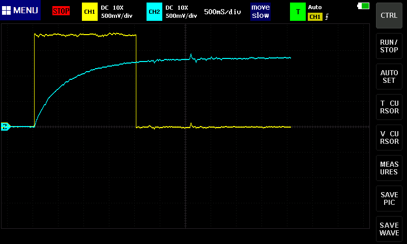

# Breadboard Computer v2

This project is related to building hardware more than a software project.  There will be some code added to this project later on for programming the firmware and downloading a program, but that will be in the final stages.

This project is inspired by [Ben Eater's Breadboard Computer](https://eater.net/8bit).  Currently as this get started, I have his computer nearly complete and I am working on the final connections and debugging before I get into the control logic.

As usual with my personal projects, I am compelled to keep a journal of this progress.  As usual with my journals, I will not go back and edit anything historical as these are my continuing thoughts rather than documentation of the final product.

## Power Reset Module

Next, I am going to work on the Power Reset Module.  This module is used to put the CPU into a known state prior to executing code.  This will include loading the first instruction location from some ROM location (if I follow the MOS 6502, that will be something like `0xfffe` & `0xffff`).  If I follow the x86 convention, I can set the Program Counter to be `0xffff` and load the first instruction from there.  Since jumps will require an offset, this may need to be `0xfff0`.

At the same time, I have a need to have a Zero Register in the system.  This should be able to be included on this module as I anticipate there will be room.

---

### 2022-Jan-29

So, the power on-reset logic only requires a 74LS14 (Inverter with Schmitt trigger).  Integrating that into the control logic is going to require a 74LS32 (OR gate).  That leaves room for at most 3 additional components on the one board:
* 74LS157 (Quad 2-to-1 data selector (for zero or reset starting address))
* 74LS245 (3-state Buffer)

The problem here is that the clock is not firing during this time, so I need all kinds of special logic to perform this reset and start executing at the defined address.

What I did consider was a special instruction (`0x00`) which will perform the reset and start executing.  The problem with thats instruction is that if we start executing unprogrammed memory, we have a change of restarting.  That could be a feature!

So, if that is the case, I have no need to the 2 X 74LS157 chips as there would only ever be the need for a Zero-Register.  It would also give me the chance to add a couple of stand-alone LEDs for the reset indicator and for the Zero-Register output indicator (no need for register contents and no need for input from the bus).

With that, here is the basic board layout:

The LED on the left will indicate the power-up reset in action while the LED on the right will indicate the Zero-Register is being output to the bus.

Since the 2 ICs on the left are not going to be fully populated and this board will be on the bottom-left corner, I may move the RC combo to the upper side of the board.  Only 1 inverter will be used and 2 OR gates will be used -- no matter what the bottom side of those ICs can be left unpopulated.

Of course, as soon as I have it wired up, there is something not working.  Time for the scope.

---

So, my overly simplistic power up circuit was, well....  overly simplistic.  As a result, I ended up with a ton of jitter, which would make a mess of things for sure.  Have a look at one of the worst cases I saw:

Since I was working with a Schmitt trigger IC, and because it is supposed to eliminate noise like what I was experiencing, I decided to try to wire 3 of them up in series.  This should (in my mind anyway) reduce the jitter for each circuit.  It did:

I really like the nice, sharp drop now.  Plus, the voltage is much better.  I also ended up adding a 1µF capacitor across the power rails and a 0.01µF capacitor at the 74LS14 IC across the power pin and ground.  However, that have the effect of having a 2 capacitors connected in parallel.  For a moment I thought the formula would have that a much smaller capacitance, but I had the formulas backward.  Capacitance in parallel and resistance in series are additive.

That said, I am going to remove the 0.1µF capacitor and move the 1µF capacitor to the power pin for the 74LS14.  I really need to test that change.  And that is working the way I need it to.

---

OK, I think I actually have this (split is it?) module complete.  I ran into an issue where I may have a bad OR gate, giving output to one of the input pins.  I need to test that IC a little more, but in the meantime, I have replaced it.

The final design has 4 of the 6 Inverters being used on the 74LS14.  I needed one additional one for outputting the Zero Register onto the bus since the signal is active low.

The final board looks like this:

There are 2 temporary lines that are pulled low.  One is for halting the clock and the other is for clearing all the registers.

The only thing left is to create a schematic.

---

### 2022-Jan-30

I realized while I was documenting this module for the [Readme](../Readme.md), I neglected to add a manual reset to the module.  I will need to add that today.

Here is the updated schematic with the reset button added.

This has been tested and works properly.
