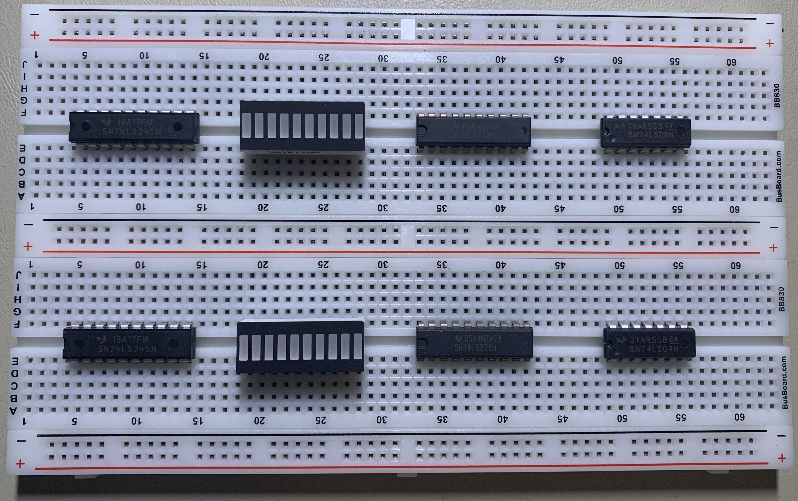
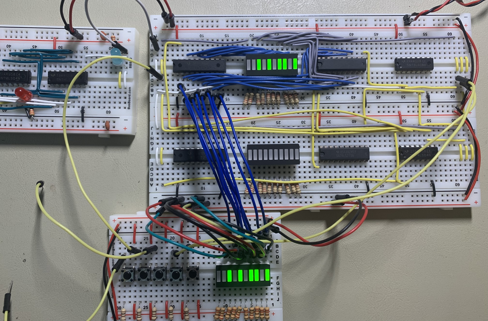
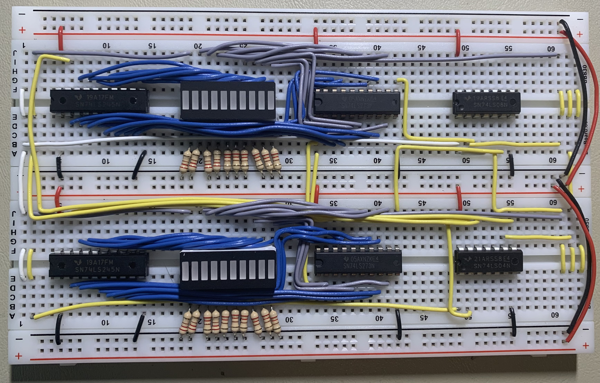
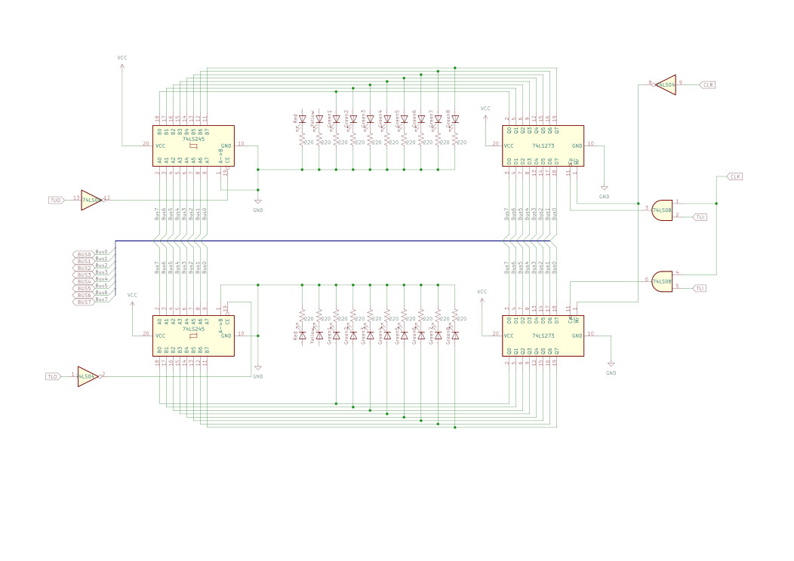

# Breadboard Computer v2

This project is related to building hardware more than a software project.  There will be some code added to this project later on for programming the firmware and downloading a program, but that will be in the final stages.

This project is inspired by [Ben Eater's Breadboard Computer](https://eater.net/8bit).  Currently as this get started, I have his computer nearly complete and I am working on the final connections and debugging before I get into the control logic.

As usual with my personal projects, I am compelled to keep a journal of this progress.  As usual with my journals, I will not go back and edit anything historical as these are my continuing thoughts rather than documentation of the final product.

## Temporary Register

There are a number of registers that need to be built for this computer.  Several of them are going to look the same or will be built as mirror images of each other.  The most basic of these will be the Temporary Register, which will not be accessible from software directly.  It will instead be used by Microcode to assemble 16-bit values from a referenced memory location.

---

### 2022-Jan-30

Ben Eater used 74LS173 ICs for the registers, which used pins 9 & 10 to load the 4 bits.  I am going to use 74LS273 ICs to accomplish the same thing.  However, the 74LS273 registers will load a value on any clock pulse.  Therefore, I will need to AND the clock pulse with the Register In Control Line and then feed that result to pin 11 on the 74LS273.

Like the Program Counter, I am going to use the 10-bar LED graph to indicate the register contents, with the yellow LED to indicate input from the bus and the red LED to indicate output to the bus.

Otherwise, the layout is quite simple and not dense at all.

This register will be on the right-side of the bus.  I will get the initial wire-up (common connections, power, ground, power limiting resistors) taken care of.

---

It took a couple hours to get to the point I had the upper byte wired up.  Here is a test of that half-register.

It did not take too long ot wire up and test the lower byte of the register.  This module came together and tested properly quick.  I think that's good because I have several to do.

Here is the complete module:

---

### 2022-Jan-31

Today I signed up for a course on https://corsera.org: **Linear Circuits 1: DC Analysis**.  This is going to slow me down a bit (but there are budget concerns as well, so slower will be better), but I will be better off for it I think.

I also want to get in the schematic for the Temporary Register.

---

### 2022-Feb-01

Here is the schematic for the Temporary Register.

This should wrap up this module.

