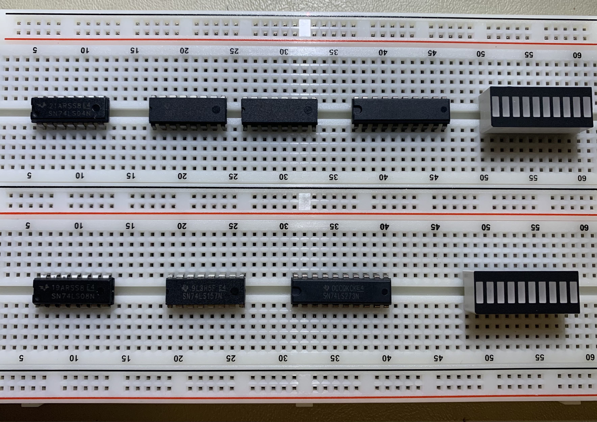
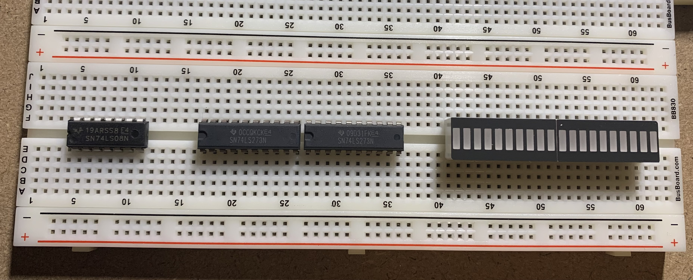
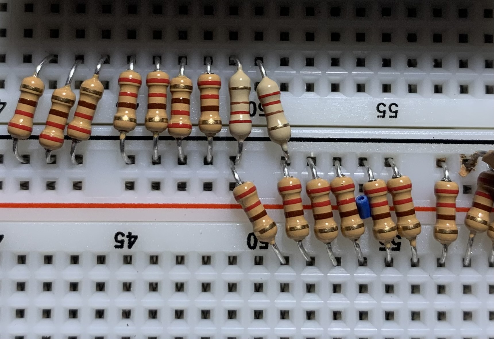
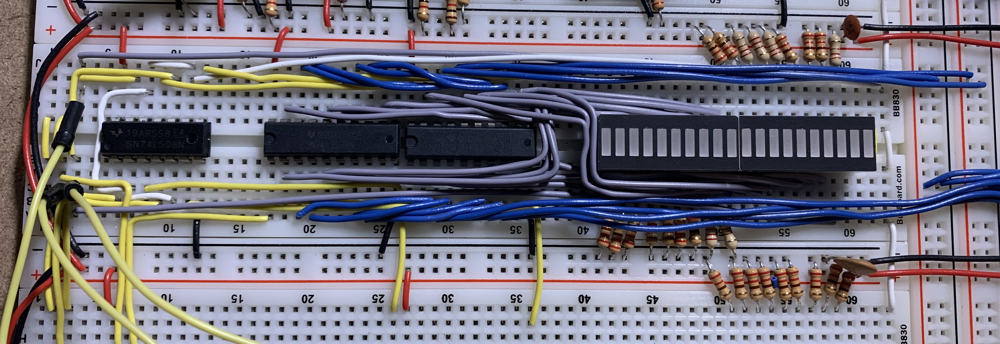
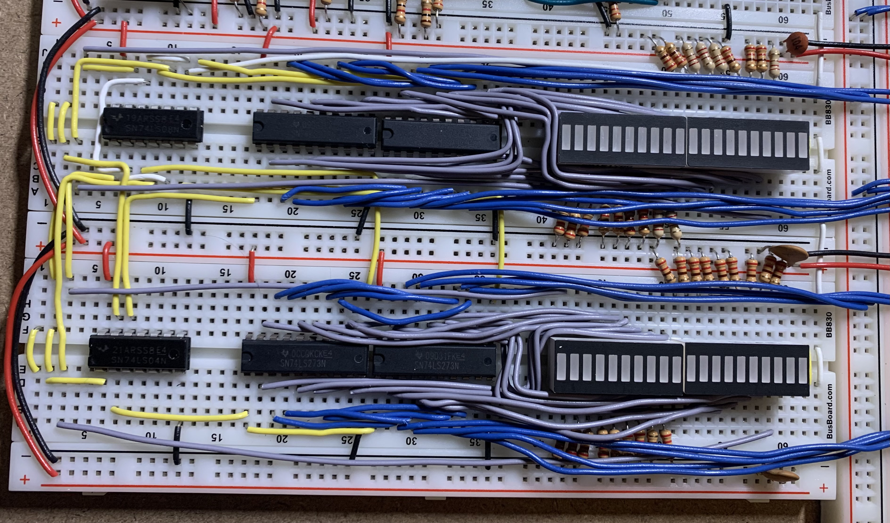

# Breadboard Computer v2

This project is related to building hardware more than a software project.  There will be some code added to this project later on for programming the firmware and downloading a program, but that will be in the final stages.

This project is inspired by [Ben Eater's Breadboard Computer](https://eater.net/8bit).  Currently as this get started, I have his computer nearly complete and I am working on the final connections and debugging before I get into the control logic.

As usual with my personal projects, I am compelled to keep a journal of this progress.  As usual with my journals, I will not go back and edit anything historical as these are my continuing thoughts rather than documentation of the final product.

## Memory Address Module

This module is actually 2 registers and an adder:
* Memory Address Register (MAR) -- this will be an internal register which will be used to set a base memory address, typically from the Stack Pointer or Program Counter
* Memory Index Register (MIR) -- this will be an offset (forward or backward) from the Memory Address Register; every access to memory will use this Register and as such may be 0 much of the time
* Memory Address Adder (MAA) -- this will add the MAR and MIR together and the result of this operation will be used for every Memory access
* Memory Address Proper (MAP) -- this will be the actual address which will be used for every memory access

Each of these will only load values from the bus (none will output values to the bus).  Contrast that with the need to output the *contents* of the memory at the Memory Address Proper to the bus, which is a future module.

That said, this module will take a bit to build.  Each of the 4 sections above will be included in this module and Journal file.

---

## Memory Address Register (MAR) Sub-Module

---

### 2022-Feb-01

I'm not going to lie: for a little while I thought I could lay out the MAR on one board.  Actually, I can.  I thought I could keep the upper address byte on the top of the board and the lower on the bottom.  I can.  I was hopeful I could save a board.  I could.

*Except....*

The 8 lined that need to be brought down to the adder had absolutely no room on the breadboard and would need to be routed off-module or looped over the ICs.

I decided to keep the MAR separated to 2 breadboards.  This is consistent with the initial expected layout.  The dry layout (before wires) is very sparse:

Notice that there is no 74LS245 IC -- since there is no need to output to the bus, there is no need for a tri-state buffer.  This saves me an IC on each breadboard.

Also (though it is not evident in the picture), the LED is facing the opposite direction so the cathodes are on top rather than on the bottom as with all the other modules built so far.  This will mean I do not want to attach this module to the Clock timer *after* it is built.  I will be assembling this attached to the Clock Module; please understand this fact when it makes an inevitable appearance in the pictures.

---

Now, I probably should consider how I am going to program the memory remotely.  I do plan on using an Arduino Nano to accomplish this.  For this to happen, I am going to need to set the MAR, MIR (to 0), and then populate the data on the bus and trigger a write from the bus to memory.

For this to work, I need to be able to load the MAR from 2 sources:
* From the bus when in run mode
* From the Arduino registers when in program mode

I will probably need to add a 74LS157 (2-to-1 decoder) to pull the address from the proper source.  Since the 74LS157 is a 4-bit decoder, I will need 4 of them.  Alternatively, I can program the upper and then lower MAR bytes separately and use twice the clock cycles to accomplish the programming cycle.

The upper board would be if I was able to set all 16-bits of the address at the same time.  This would add ICs and reduce programming time.  I am concerned about power already.

The lower board would be if I was to set the upper and lower bytes separately.  This would effectively double the time it took to program the RAM.

A third alternative is to integrate directly into the bus and control logic so that there was effectively 2 sets of control logic.  I actually like the elegance of this design -- to take over the computer to program the RAM.  And this means I do not have to do anything special for the MAR.  But I may have to change the Clock Module to accommodate the separate clock source.

Hmmm.... I wonder if I could use a diode to keep the clock signal from back-bleeding into the clock and vice-versa from the Arduino....  I am going to order some and play with them on a board and oscilloscope.  In the meantime, I will do the foundational wire-up.

---

### 2022-Feb-02

I have the MAR completed.  It really was a simple wire-up.

It is also hooked up to the bus, along with all the other completed modules.

So, with this, I move on to the Memory Index Register (MIR).  It happens to be a complete duplicate of the MAR.  So...., second verse; same as the first!

---

## Memory Index Register (MIR) Sub-Module

This sub-module will be located immediately below the MAR.

---

### 2022-Feb-02 (continued)

The question is whether I leverage the MAR's existing 74LS04 and 74LS08 chips, which have enough capacity to host the MIR requirements.

The Inverter is only using 1 of 6 gates.  This is very wasteful.  The AND gate is 50% populated.  Again this is wasteful.  Especially since I am concerned about power.

The layout is still tight, but this is far more doable by splitting the 74LS04 & 74LS08 over 2 boards.

I think the key to making this work is that the 74LS08 (AND gates) will be fully populated and if I need another AND gate, it will be in the adder or in the Memory Address Proper (MAP); however, the 74LS04 (Inverter) still has capacity and can be leveraged for the adder or the MAP.  So, the 74LS08 needs to be placed with the MAR whereas the 74LS04 can be placed with the MIR.

Of course, this means I need to tear up the MAR and redo it.

---

I knew things would get tight with the LED graphs..., and they did!

Yes, there are 2 resistors doubled up in the ground connection.  I'm going to live with it for now.

I still have foundational connections to complete (again), but I am not up for all that (again) tonight.

---

### 2022-Feb-03

Today I completed the control lines.

---

Also, as a side note, I started working on a bench-top power supply from an old retired ATX power supply.  This old power supply is a 750W monster and will provide plenty of DC power for nearly all my needs.

I am not going to document this project, as there are plenty of videos and the like on how to do this.  I will post a picture of the results in a future journal.

---

### 2022-Feb-04

Well, last night I was able to get the MAR re-wired.  In the end it looked like this:

Today, I tackled the MIR and got that wired up as well.

Both registers are properly tested (and in fact I had to wire the output of the MIR twice).

The next step is to bring the 2 register values down to a 16-bit adder.  The adder is responsible for summing the MAR and the MIR to get a aggregated address from which the memory will be read.

The MAA and the MAP will probably need to be built at the same time so that the proper contents can be evaluated.

Well, I just realized my last order was mis-picked.  This means I am unable to complete the MAA, which means I cannot complete the MAP.  Damn!

---

### 2022-Feb-05

I am approaching the point in which I need to also place the RAM onto the system.  I will also need to place that in the order to replace the adder chips.

---

### 2022-Feb-06

While I am waiting for the replacements, I have a couple of options.
1. I can wire up the A Register (which is a duplicate of the Temporary Register which has already been completed).
1. I can work on documenting the MAR and MIR schematics.
1. I can work on how I am going to handle the flags register.

I think I will work on the MAR/MIR schematics.

Actually, since the connections are off-sub-module, I may have a tough time combining them into a single schematic.

---

OK, here is the MAR schematic:

The MIR will end up being a copy of this, with some minor changes.

Copy-and-paste is a wonderful thing:

The look the same, but the off-schematic connectors are named different.  Take a close look.

---

Now, in the meantime, I will work on the A Register.

---

### 2022-Feb-11

Well, I had a but of an epiphany yesterday while I am out and about: Why am I worried about stupid optimizations when I need to be worried about getting this iteration completed.  As such, why do I need a MAR, MIR, MAA, and MAP when all I really need is a MAR and an ALU.  The same question goes for the stack: why do I need it when I can use the ALU?  Yeah, it may take an extra clock cycle or two, but I am going for the blinking lights more than I am going for speed.  If I want speed, I will buy another laptop.

So, I need to go back and revisit my work on the Memory Address Module (which will be torn down and redone), and the A and Temporary Registers (as they may be relocated and need to be flipped.

With that said, I am going paste this same update into all 3 Journals since they will all need to be revisited.

