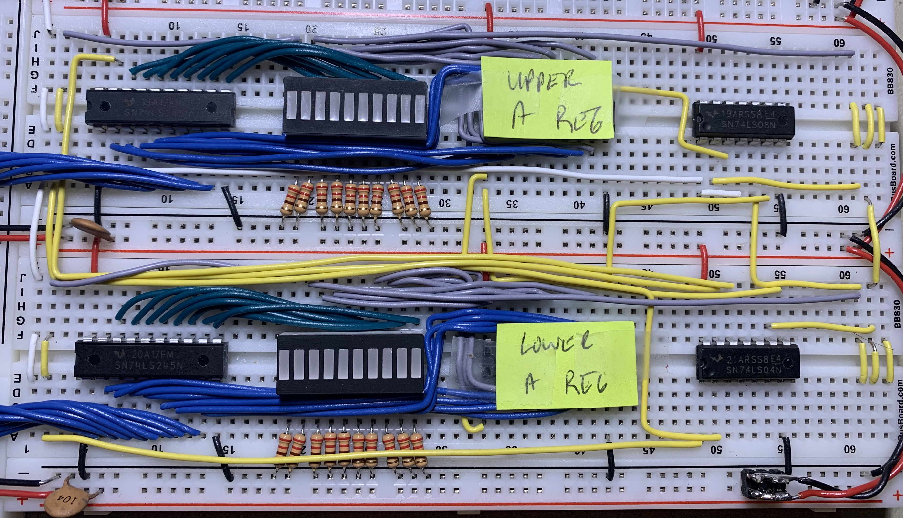

# Breadboard Computer v2

This project is related to building hardware more than a software project.  There will be some code added to this project later on for programming the firmware and downloading a program, but that will be in the final stages.

This project is inspired by [Ben Eater's Breadboard Computer](https://eater.net/8bit).  Currently as this get started, I have his computer nearly complete and I am working on the final connections and debugging before I get into the control logic.

As usual with my personal projects, I am compelled to keep a journal of this progress.  As usual with my journals, I will not go back and edit anything historical as these are my continuing thoughts rather than documentation of the final product.

## A Register

The A Register is an exact duplicate of the [Temporary Register](Journal-04-Temporary-Register.md).  As such, there will not be as many pictured and commentary on the process.  I will comment on the overall progress.

### 2022-Feb-06

So, while I am waiting for my [MAA components](Journal-05-Memory-Address-Module.md#2022-feb-04) to get settled, I have already completed the foundational wire-up.

---

### 2022-Feb-07

I worked a bit on the A Register.  My vendor was willing to re-send the mis-picked ICs without charge.  I should have my replacements in about 2 days.

In other news, I believe I will be able to put a screen onto this computer which should be able to output character data.  This 'monitor' should be able to be driven by an Arduino Nano as a micro-controller.

---

### 2022-Feb-08

Well, today I realized I used the wrong color wires for some of my intra-board connections.  They should have been green for the on-board hook-ups; I used blue.  I want to go back and resolve that: it's my inner OCD!

In the meantime, I did complete the A Register wire-up.  It is not tested yet.  I will do that tomorrow as I am defeated with the above realization.

---

### 2022-Feb-09

Today I started working on the Microcode for each instruction.  I have some time to kill before my supplies arrive.  Working on this has exposed some problems -- namely that I really need 2 temp registers to work with the ALU.  Well, damn!

---

OK, I was able to get the boards re-wired with the correct colors.  It's a detail, I know.

At the same time, I have about a third of the microcode designed.  I think the longest instruction will require 18 clock cycles -- for hardware and software interrupts each.

I do expect to get the replacement ICs Saturday, which is later than I want.  On the other hand, I did get the RAM today, so that is a benefit.

I also realized I need 2 temp registers to operate the ALU -- 1 temp register plus the A register would not deliver what I need.  So, I need to reconsider the layout again.

Overall, the last 2 days might seem like defeat after defeat, but in reality it is all progress.

Now, I think I have all the parts I need to electrically connect up the bench-top power supply.  This will allow me to have more stable power (compared to the noisy switching adaptor I have been using).

I also realized today I need to have several constant values to be used for the CPU.  I will need to be able to set those up and deliver those to the bus on demand as pseudo-registers.  At the moment, I am looking at something close to 64-80 control bits.  I need to figure out how to reduce that ahead of the control logic build.

That said, the A Register is actually complete.

Tomorrow, I complete the schematic, a copy of the Temp Register, of which I now need 2.

---

### 2022-Feb-11

Well, I had a but of an epiphany yesterday while I am out and about: Why am I worried about stupid optimizations when I need to be worried about getting this iteration completed.  As such, why do I need a MAR, MIR, MAA, and MAP when all I really need is a MAR and an ALU.  The same question goes for the stack: why do I need it when I can use the ALU?  Yeah, it may take an extra clock cycle or two, but I am going for the blinking lights more than I am going for speed.  If I want speed, I will buy another laptop.

So, I need to go back and revisit my work on the Memory Address Module (which will be torn down and redone), and the A and Temporary Registers (as they may be relocated and need to be flipped.

With that said, I am going paste this same update into all 3 Journals since they will all need to be revisited.

---

### 2022-Feb-18

What used to be the A Register Module has now become the Temporary Register 1 Module.  And the Lower Temporary Register 1 portion is wired totally wrong.

I need to correct this and I will need to re-make an A Register.  Until I get to a new A Register, I am going to continue the monologue on this module under the Temporary Register 1 Journal.