# Breadboard Computer v2

This project is related to building hardware more than a software project.  There will be some code added to this project later on for programming the firmware and downloading a program, but that will be in the final stages.

This project is inspired by [Ben Eater's Breadboard Computer](https://eater.net/8bit).  Currently as this get started, I have his computer nearly complete and I am working on the final connections and debugging before I get into the control logic.

As usual with my personal projects, I am compelled to keep a journal of this progress.  As usual with my journals, I will not go back and edit anything historical as these are my continuing thoughts rather than documentation of the final product.

## Memory Address Module

This module is actually 2 registers and an adder:
* Memory Address Register (MAR) -- this will be an internal register which will be used to set a base memory address, typically from the Stack Pointer or Program Counter
* Memory Index Register (MIR) -- this will be an offset (forward or backward) from the Memory Address Register; every access to memory will use this Register and as such may be 0 much of the time
* Memory Address Adder (MAA) -- this will add the MAR and MIR together and the result of this operation will be used for every Memory access
* Memory Address Proper (MAP) -- this will be the actual address which will be used for every memory access

Each of these will only load values from the bus (none will output values to the bus).  Contrast that with the need to output the *contents* of the memory at the Memory Address Proper to the bus, which is a future module.

That said, this module will take a bit to build.  Each of the 4 sections above will be included in this module and Journal file.

---

## Memory Address Register (MAR) Sub-Module

---

### 2022-Feb-01

I'm not going to lie: for a little while I thought I could lay out the MAR on one board.  Actually, I can.  I thought I could keep the upper address byte on the top of the board and the lower on the bottom.  I can.  I was hopeful I could save a board.  I could.

*Except....*

The 8 lined that need to be brought down to the adder had absolutely no room on the breadboard and would need to be routed off-module or looped over the ICs.

I decided to keep the MAR separated to 2 breadboards.  This is consistent with the initial expected layout.  The dry layout (before wires) is very sparse:

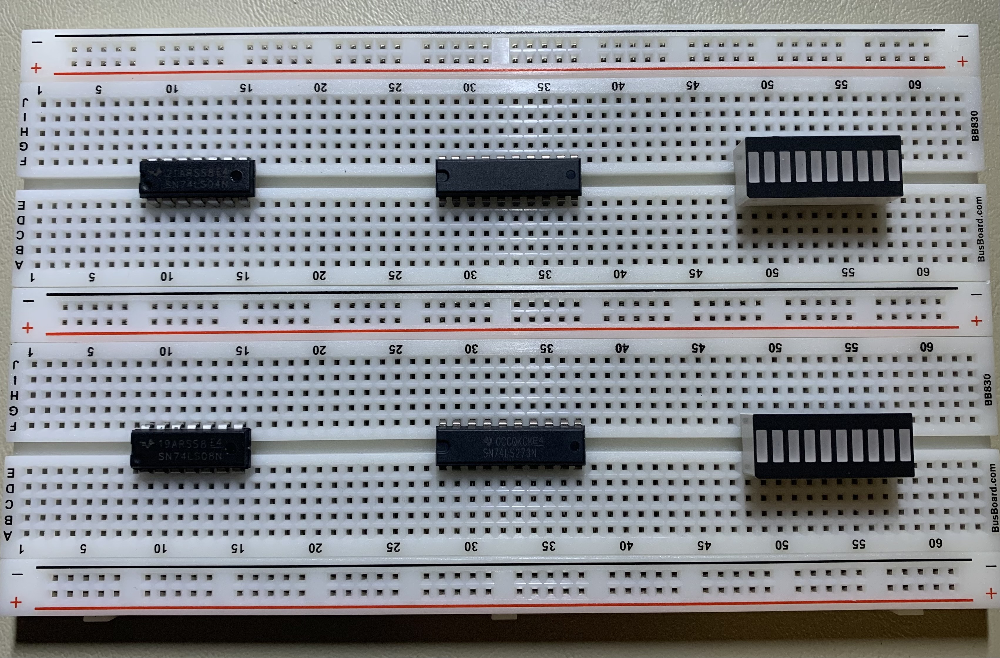

Notice that there is no 74LS245 IC -- since there is no need to output to the bus, there is no need for a tri-state buffer.  This saves me an IC on each breadboard.

Also (though it is not evident in the picture), the LED is facing the opposite direction so the cathodes are on top rather than on the bottom as with all the other modules built so far.  This will mean I do not want to attach this module to the Clock timer *after* it is built.  I will be assembling this attached to the Clock Module; please understand this fact when it makes an inevitable appearance in the pictures.

---

Now, I probably should consider how I am going to program the memory remotely.  I do plan on using an Arduino Nano to accomplish this.  For this to happen, I am going to need to set the MAR, MIR (to 0), and then populate the data on the bus and trigger a write from the bus to memory.

For this to work, I need to be able to load the MAR from 2 sources:
* From the bus when in run mode
* From the Arduino registers when in program mode

I will probably need to add a 74LS157 (2-to-1 decoder) to pull the address from the proper source.  Since the 74LS157 is a 4-bit decoder, I will need 4 of them.  Alternatively, I can program the upper and then lower MAR bytes separately and use twice the clock cycles to accomplish the programming cycle.

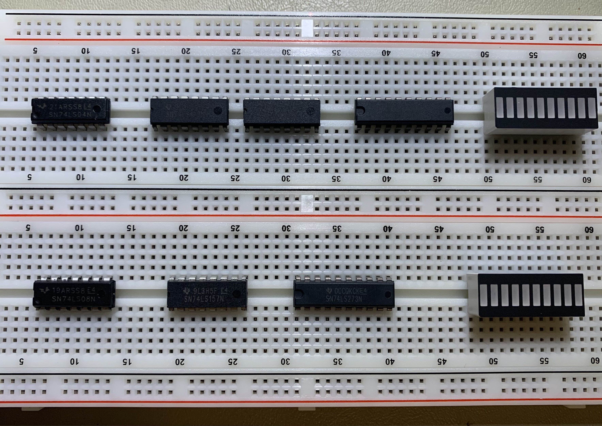

The upper board would be if I was able to set all 16-bits of the address at the same time.  This would add ICs and reduce programming time.  I am concerned about power already.

The lower board would be if I was to set the upper and lower bytes separately.  This would effectively double the time it took to program the RAM.

A third alternative is to integrate directly into the bus and control logic so that there was effectively 2 sets of control logic.  I actually like the elegance of this design -- to take over the computer to program the RAM.  And this means I do not have to do anything special for the MAR.  But I may have to change the Clock Module to accommodate the separate clock source.

Hmmm.... I wonder if I could use a diode to keep the clock signal from back-bleeding into the clock and vice-versa from the Arduino....  I am going to order some and play with them on a board and oscilloscope.  In the meantime, I will do the foundational wire-up.

---

### 2022-Feb-02

I have the MAR completed.  It really was a simple wire-up.

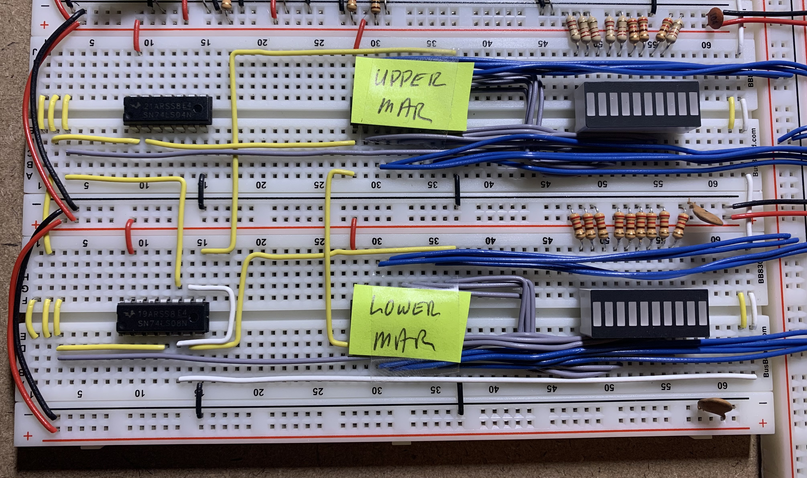

It is also hooked up to the bus, along with all the other completed modules.

So, with this, I move on to the Memory Index Register (MIR).  It happens to be a complete duplicate of the MAR.  So...., second verse; same as the first!

---

## Memory Index Register (MIR) Sub-Module

This sub-module will be located immediately below the MAR.

---

### 2022-Feb-02 (continued)

The question is whether I leverage the MAR's existing 74LS04 and 74LS08 chips, which have enough capacity to host the MIR requirements.

The Inverter is only using 1 of 6 gates.  This is very wasteful.  The AND gate is 50% populated.  Again this is wasteful.  Especially since I am concerned about power.

The layout is still tight, but this is far more doable by splitting the 74LS04 & 74LS08 over 2 boards.

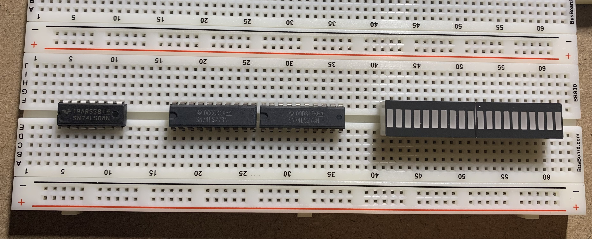

I think the key to making this work is that the 74LS08 (AND gates) will be fully populated and if I need another AND gate, it will be in the adder or in the Memory Address Proper (MAP); however, the 74LS04 (Inverter) still has capacity and can be leveraged for the adder or the MAP.  So, the 74LS08 needs to be placed with the MAR whereas the 74LS04 can be placed with the MIR.

Of course, this means I need to tear up the MAR and redo it.

---

I knew things would get tight with the LED graphs..., and they did!

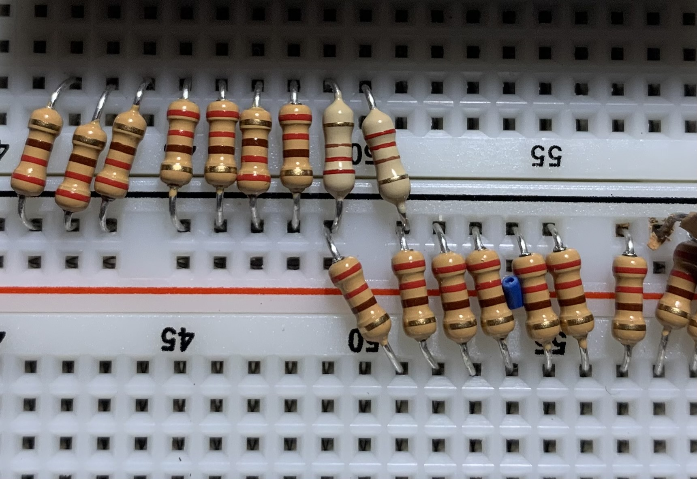

Yes, there are 2 resistors doubled up in the ground connection.  I'm going to live with it for now.

I still have foundational connections to complete (again), but I am not up for all that (again) tonight.

---

### 2022-Feb-03

Today I completed the control lines.

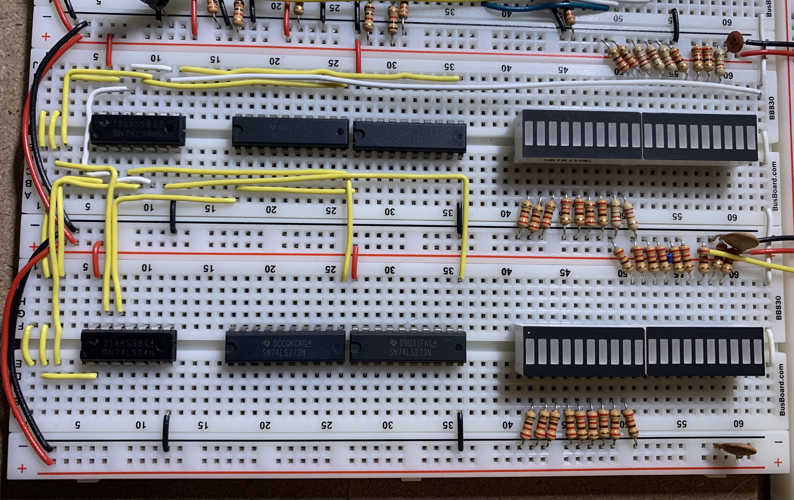

---

Also, as a side note, I started working on a bench-top power supply from an old retired ATX power supply.  This old power supply is a 750W monster and will provide plenty of DC power for nearly all my needs.

I am not going to document this project, as there are plenty of videos and the like on how to do this.  I will post a picture of the results in a future journal.

---

### 2022-Feb-04

Well, last night I was able to get the MAR re-wired.  In the end it looked like this:

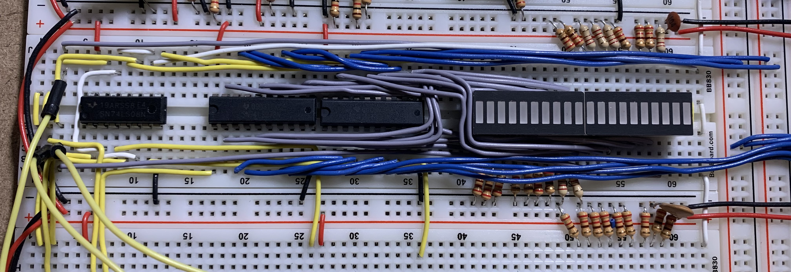

Today, I tackled the MIR and got that wired up as well.

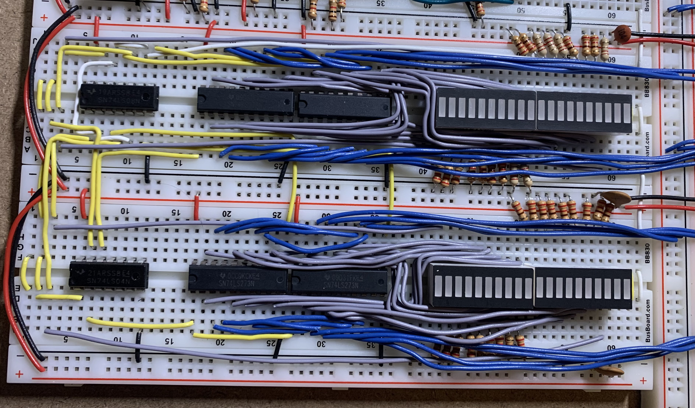

Both registers are properly tested (and in fact I had to wire the output of the MIR twice).

The next step is to bring the 2 register values down to a 16-bit adder.  The adder is responsible for summing the MAR and the MIR to get a aggregated address from which the memory will be read.

The MAA and the MAP will probably need to be built at the same time so that the proper contents can be evaluated.

Well, I just realized my last order was mis-picked.  This means I am unable to complete the MAA, which means I cannot complete the MAP.  Damn!

---

### 2022-Feb-05

I am approaching the point in which I need to also place the RAM onto the system.  I will also need to place that in the order to replace the adder chips.

---

### 2022-Feb-06

While I am waiting for the replacements, I have a couple of options.
1. I can wire up the A Register (which is a duplicate of the Temporary Register which has already been completed).
1. I can work on documenting the MAR and MIR schematics.
1. I can work on how I am going to handle the flags register.

I think I will work on the MAR/MIR schematics.

Actually, since the connections are off-sub-module, I may have a tough time combining them into a single schematic.

---

OK, here is the MAR schematic:

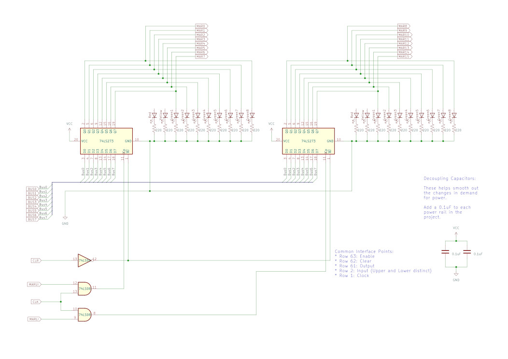

The MIR will end up being a copy of this, with some minor changes.

Copy-and-paste is a wonderful thing:

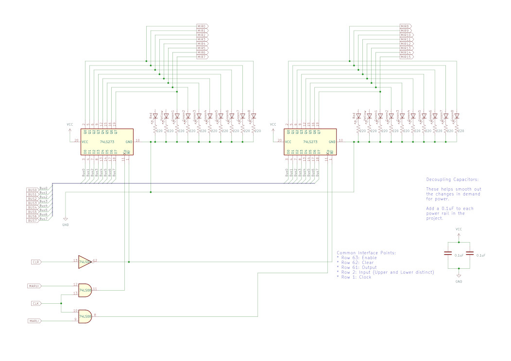

The look the same, but the off-schematic connectors are named different.  Take a close look.

---

Now, in the meantime, I will work on the A Register.

---

### 2022-Feb-11

Well, I had a but of an epiphany yesterday while I am out and about: Why am I worried about stupid optimizations when I need to be worried about getting this iteration completed.  As such, why do I need a MAR, MIR, MAA, and MAP when all I really need is a MAR and an ALU.  The same question goes for the stack: why do I need it when I can use the ALU?  Yeah, it may take an extra clock cycle or two, but I am going for the blinking lights more than I am going for speed.  If I want speed, I will buy another laptop.

So, I need to go back and revisit my work on the Memory Address Module (which will be torn down and redone), and the A and Temporary Registers (as they may be relocated and need to be flipped.

With that said, I am going paste this same update into all 3 Journals since they will all need to be revisited.

---

### 2022-Feb-25

OK, my direction here has changed (see the last update above).  As such, the current Memory Address Register needs a complete gut and redo (or maybe just some selective surgery if I can).

At the same time, this file will be renamed to align with the new naming standards and the schematics will be updated as well.  I have a MIR schematic which will need to be deprecated, but I'm sure I have some images herein to relocate for posterity.

Here is my starting point today (separated from the rest of the computer):

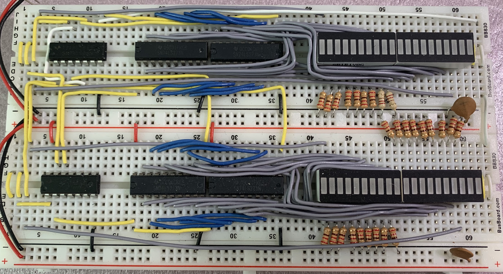

If feels like kindergarten craft hour!

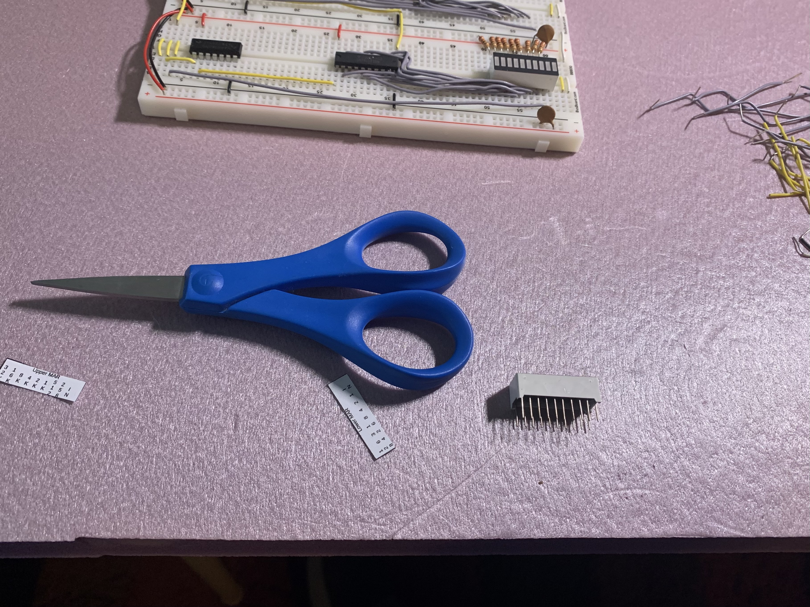

And, I think I have the MAR all cleaned up:

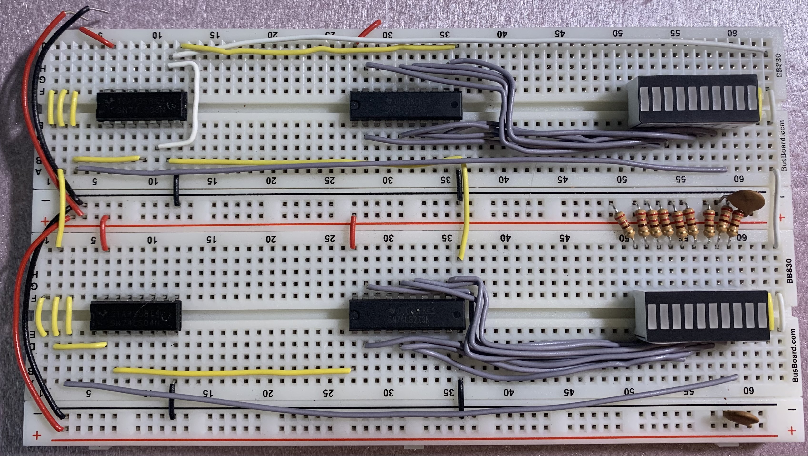

It is, of course, untested as of yet.  Next step will be to hook this back up to the whole computer and perform some testing.

Well, the Upper MAR is wired backwards.  Just like the Temporary Registers were.

---

OK, after a small break, I was able to get that rewired properly.  It also tested out properly.

---

### 2022-Feb-27

The task today is to get the schematics updated.

Done:

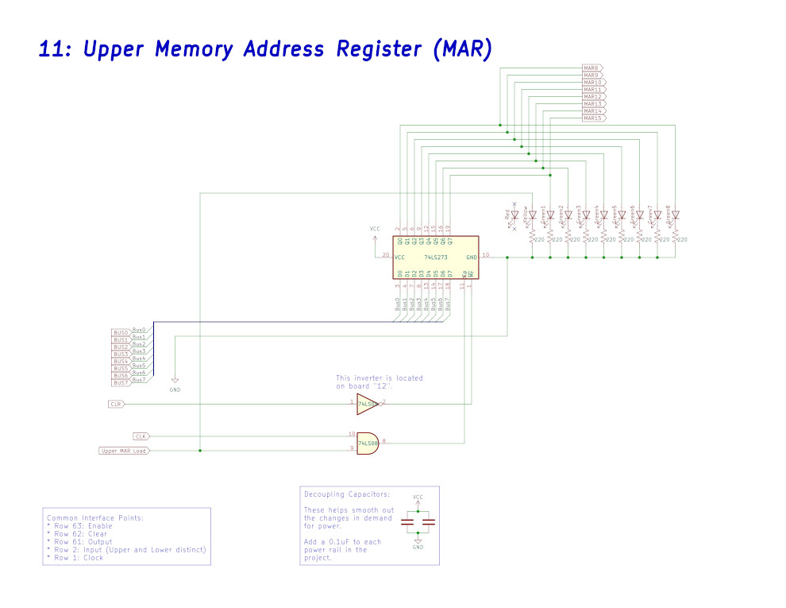

... and the lower:

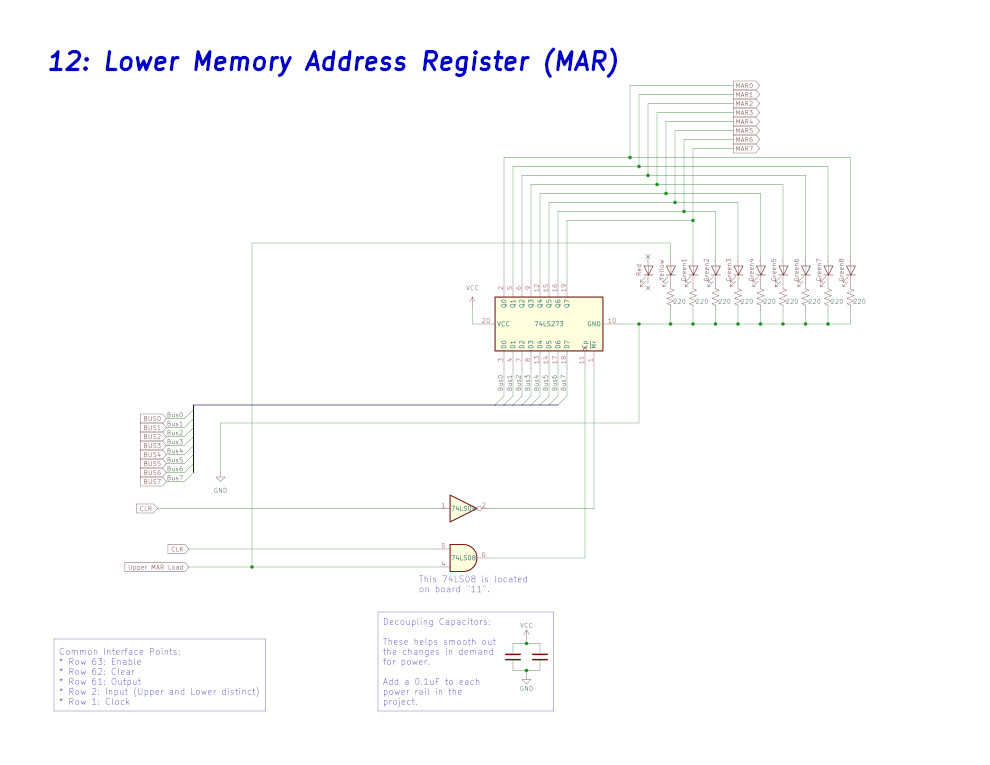

---

Now, there is going to be a RAM and a ROM component to the memory.  ROM will be located from `0xd000` (or maybe even `0xc000`) to `0xffff` (12K - 16K total ROM memory).  So, this means that addresses from `0x8000` to `0xcfff` all need to be handled by RAM.

So, I can discern which to handle based on the most significant 4 bits, in the following manner:

| Bit 15 | Bit 14 | Bit 13 | Bit 12 | Address | Memory |
|:------:|:------:|:------:|:------:|:-------:|:------:|
|   1    |   0    |   0    |   0    | 0x8000  | RAM    |
|   1    |   0    |   0    |   1    | 0x9000  | RAM    |
|   1    |   0    |   1    |   0    | 0xa000  | RAM    |
|   1    |   0    |   1    |   1    | 0xb000  | RAM    |
|   1    |   1    |   0    |   0    | 0xc000  | ROM    |
|   1    |   1    |   0    |   1    | 0xd000  | ROM    |
|   1    |   1    |   0    |   1    | 0xe000  | ROM    |
|   1    |   1    |   1    |   1    | 0xf000  | ROM    |

Actually, Bit 15 is always set.  So it should be trivial to determine if I am working with the Upper RAM/ROM or the Lower RAM.  So, assuming that we are halved to the upper RAM/ROM, the next 3 bits will determine RAM vs. ROM.  And looking at it, I am going to go ahead and make the call that the ROM will be from `0xc000` and above.  This makes the determination only 1 bit from the Upper RAM/ROM module.  However, this decision means I can work mostly from the top 2 bits and inverters (with a small handful of AND gates).

For the inverters, I need:
* Upper In
* Upper Out
* Lower In
* Lower Out
* (Pin 15 & 14) selection

For the AND Gates, I need:
* CLK & Upper In
* CLK & Lower In
* Pin 15 & Pin 14

Hmmm....  This is not right.  I am forgetting that the whole point of this is to present a single byte to the bus.  I may need some more logic gates to make that work.

So, the following table will be used to determine which chip is enabled:

| Bit 15 | Bit 14 | Address Range | Memory    |
|:------:|:------:|:-------------:|:---------:|
|   0    |   0    | 0x0000-0x3fff | Lower RAM |
|   0    |   1    | 0x4000-0x7fff | Lower RAM |
|   1    |   0    | 0x8000-0xbfff | Upper RAM |
|   1    |   1    | 0xc000-0xffff | ROM       |

So, the truth table for Lower RAM should be simple (`CE` set low):

| b15 | \CE          |
|:---:|:------------:|
|  0  | 0 (Enabled)  |
|  1  | 1 (Disabled) |

The truth table for Upper RAM is:

| b15 | b14 | \CE          |
|:---:|:---:|:------------:|
|  0  |  0  | 1 (Disabled) |
|  0  |  1  | 1 (Disabled) |
|  1  |  0  | 0 (Enabled)  |
|  1  |  1  | 1 (Disabled) |

So `NOT (b15 AND (NOT b14))`.  I think this can be reduced to `b15 NAND (NOT b14)`.  Let's see:

| b15 | b14 | \b14 | Res |
|:---:|:---:|:----:|:---:|
|  0  |  0  |   1  |  1  |
|  0  |  1  |   0  |  1  |
|  1  |  0  |   1  |  0  |
|  1  |  1  |   0  |  1  |

This gives the result I am looking for.

The truth table for ROM is:

| b15 | b14 | \CE          |
|:---:|:---:|:------------:|
|  0  |  0  | 1 (Disabled) |
|  0  |  1  | 1 (Disabled) |
|  1  |  0  | 1 (Disabled) |
|  1  |  1  | 0 (Enabled)  |

So, `NOT (b15 AND b14)`.  This should also be able to be reduced to `b15 NAND b14`.  Let's see:

| b15 | b14 | Res |
|:---:|:---:|:---:|
|  0  |  0  |  1  |
|  0  |  1  |  1  |
|  1  |  0  |  1  |
|  1  |  1  |  0  |

So, I will need the following Logic Gates:
* 74LS04 -- RAM Out
* 74LS04 -- NOT b14
* 74LS08 -- CLK AND RAM In
* 74LS00 -- Upper RAM Chip Enable
* 74LS00 -- Upper ROM Chip Enable

---

### 2022-Mar-02

Well I got my supplies today, which includes the ROM memory.  I also have a new Arduino and a couple of shifters to handle programming the larger memory.

OK, thinking about this, I may have a problem here.  I have 4 places a byte can come from but I did not consider ORing the outputs together.  I really need to download and read the data sheets for the RAM and ROM to see if it really is a tri-state output before I wire it all together.  I actually have a bit of a headache tonight, so I am not going to do too much research today.  I am looking for some light-weight work to do.

---

### 2022-Mar-03

OK, data sheets....

The 28C16 reads a "High Z" output when Output is disabled, or when OE is high.  The CE (Chip Enable) also produces "High Z" when the pin is high.

On the other hand, the static RAM is "High Z" when the CS (Chip Select) is high.

So, as long as only 1 chip is active at any given point, I think I can wire all the I/O pins together.

I think the first thing I need to do is to get the different chips to be enabled at the correct points.

---

I have problems.  My truth tables are all messed up.  So, let's look at this again.

* 0x0000 to 0x7fff is the lower RAM chip
* 0x8000 to 0xbfff is the upper RAM chip
* 0xc000 to 0xdfff is the lower ROM chip
* 0xe000 to 0xffff is the upper ROM chip

Looking at the top 3 bits, I get the following:

| Bit15 | Bit14 | Bit13 | Chip      |
|:-----:|:-----:|:-----:|:---------:|
|   0   |   0   |   0   | Lower RAM |
|   0   |   0   |   1   | Lower RAM |
|   0   |   1   |   0   | Lower RAM |
|   0   |   1   |   1   | Lower RAM |
|   1   |   0   |   0   | Upper RAM |
|   1   |   0   |   1   | Upper RAM |
|   1   |   1   |   0   | Lower ROM |
|   1   |   1   |   1   | Upper ROM |

The key I forget was that I need to not only enable one chip but I need to disable everything else.  There is a 74LS138 which I can use to select the proper chip, and the outputs are inverted.  It also makes handling the Lower RAM address range difficult to manage.  There is also a 74LS139 which is a Dual 2-to-4 decoder.  Again the output is inverted.

But I honestly think I am over-thinking this.  Lower RAM can be selected when Bit15 is low.  Let me get thats working first.  This will mean that the Upper RAM chip is dark when the others are lit.

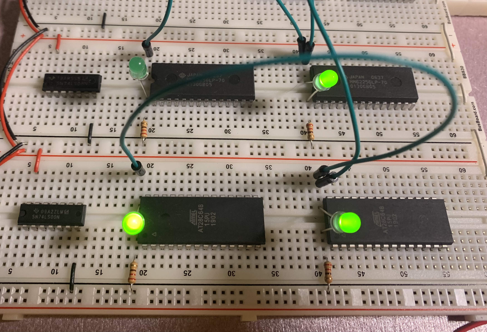

Now, for the Lower RAM chip.  This is when Bit15 is high but Bit14 is low.

The original un-simplified logic was correct: `NOT (b15 AND (NOT b14))`

---

OK, I did finally get this wired up properly.  It was more of a brute force method, but it is working.  I could probably simplify it, but I'm not going to try.

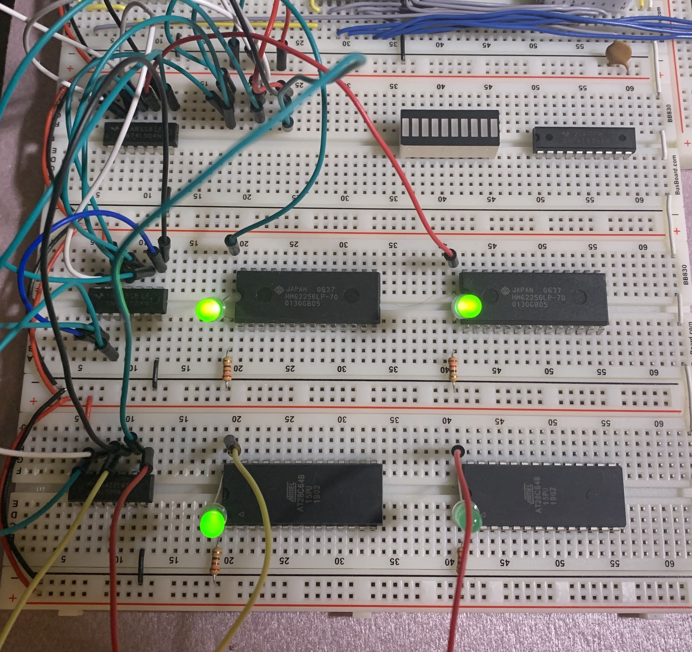

I will work on more permanent wiring tomorrow.

---

### 2022-Mar-04

I was able to get pin 15 wired up.  I also used another inverter to make the LED light up properly.

---

### 2022-Mar-05

Today I start with pin 14, which will be a little more complicated to wire up properly.

I was also able to get pin 13 wired up as well.  That should be all the complicated ones.  The problem is going to be to squeeze in all the "easy" ones.

---

### 2022-Mar-06

This morning I realized I had not completed the foundational wire-up for the RAM/ROM module.  That was fun to do with all the other wires already in place.  But, I did get it done.  I think all I have left for this module are:
* Tie /OE low for all chips
* Wire up all the address lines (0-11)
* Wire up all the outputs to the LED and 74LS245
* Connect the 74LS245 to the bus

---

### 2022-Mar-07

OK, this is starting to get under my skin!  Somehow the chip selection is no longer working like it was.  I am going to have to pull the hook-up wires just to try to debug.  I am bouncing around between too many things and I need to focus on 1 until I have it working properly.  I think I am going to take on this Memory Module and make it work.

I was able to get the control logic reset properly again.  Not sure what happened, but it did.

I also realized that I am going to need to wire up the 74LS245 as an actual transceiver, so pin 1 will control input and output direction.  Shit, no, that's not it.  Well, not all of it.

Pin 19 needs to be set when either in or out are set.  I need an OR gate for this.  Then pin 1 needs to be set when the output line is set, which is a trivial wire-up.  I actually have a 74LS32 with 1 bad OR gate, which I am going to leverage here.

OK, that is wired up properly.  So, now I have the following features with the memory:
* Only 1 memory chip is active at a time.
* All chips' outputs are wired together and to the transceiver and output LEDs, meaning I can always see what is in the contents of the memory indicated by the MAR.
* The transceiver isolates the memory unless we are inputting from or outputting to the bus.
* For RAM, when OE, CE, and WR are all tied low, the RAM writes to memory (correct).
* For the ROM, I will need to tie CE and OE together so that the chips are not outputting if an attempt is made to write to a ROM addresses.

So, this time I will be setting the control lines as yellow (not purple) and the LED indicator lines as grey (again) so I can better determine what is really going on.  The lines connecting the chips together will all be green.

---

OK, I have the Memory Module wired up to the point I thought I had gotten to last night.  That's 8 of 16 address lines wired up.  I have 8 more to do.  The good news is that these are all on the same side of the chips.  That said, stripping all those wires and bending them properly is hard on my fingers.  I am going to take a break on this tonight.

---

### 2022-Mar-10

I was able to get some additional address lines wired up today.  This is all very dense wiring so I am not having so much fun with this part.

---

### 2022-Mar-11

Here are the space constraints I am dealing with at this point:

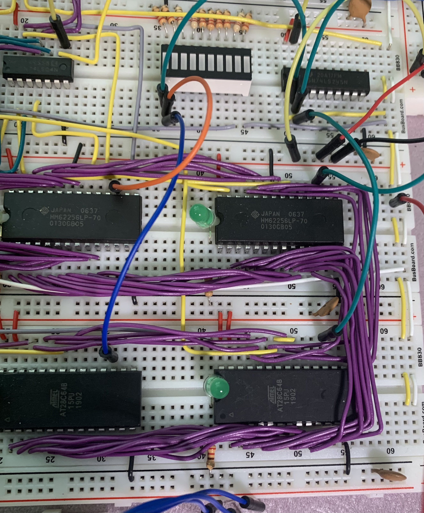

In the bottom-right and top-right corners of each chip, I need to be able to get the I/O lines routed.  There really is very little space for these lines and certainly not enough to double up anything like I did the address lines.

The fix for this problem is going to be to direct wire each chip to the output node (rather than by chaining them together).  The temporary lines show an example of this wiring.

I also discovered that I need to invert the enable line on the 74LS245 -- it was always-on the way I had it wired up.  That should be a relatively simple fix and I'm glad I caught that before I started all the I/O line wiring.

That fixed, I am going to tackle handling the LED-to-74LS245 jumpers.

---

OK, I was able to get the Memory Module wire-up completed.  Like the ALU, there is a dense amount of wiring.

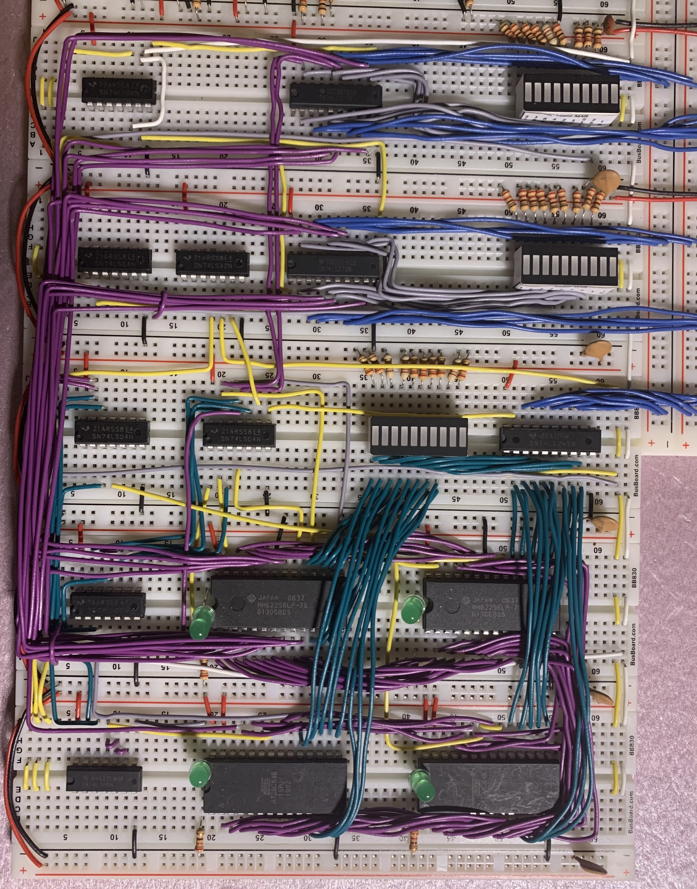

It will be hard to get to the ROM EEPROMs to program them.  So, the emulator will need to be a feature of this build to try to work out as many bugs in the firmware as possible.

I do need to test.  And create schematics.

Tomorrow.

---

### 2022-Mar-12

OK, this is working.  Mostly.  Somewhat.  Kinda.

The problem is that I am not totally certain I can describe the problem.  There does appear to be some bleed-over between the different chips, such that when I try to output to the bus I see some additional LEDs come on.

And then the problem just went away.

Which means I still have *some* problem to solve.  But right now I cannot describe it.

I'm going to need to think on this a bit and figure out what to measure.

---

Had I been thinking about it, I would have put the memory contents at the bottom rather than between the MAR and the RAM/ROM modules.  Oh, well!  Too late now....

---

OK, I think I have board "13" ready.  Here is the schematic:

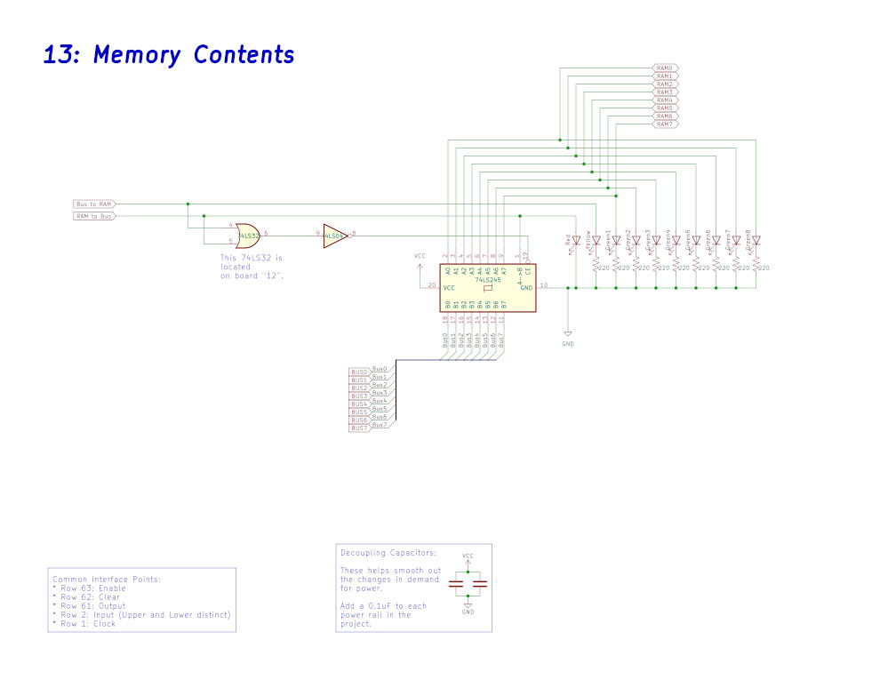

Next will be the RAM board, which has some more complicated logic for the pin selection.  But I have the fuck-its today and really don't want to do this busy work.  Maybe I can motivate myself -- or just suck it up and get it done.

---

### 2022-Mar-19

I am going to bypass the rest of the schematics until I am ready to order PCBs.  The reason is that the entire schematic will need to be redone if I go down that route.  And I do plan to go down that route.