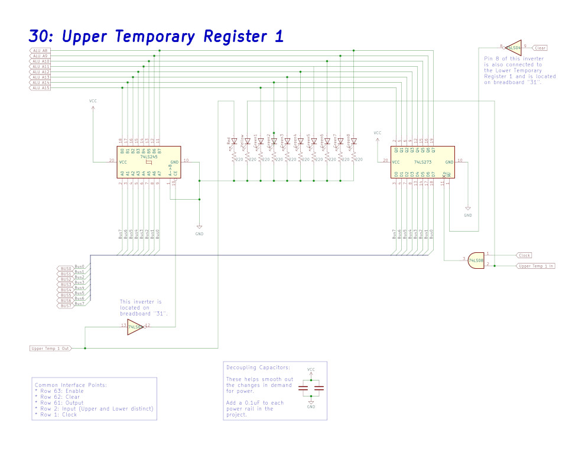
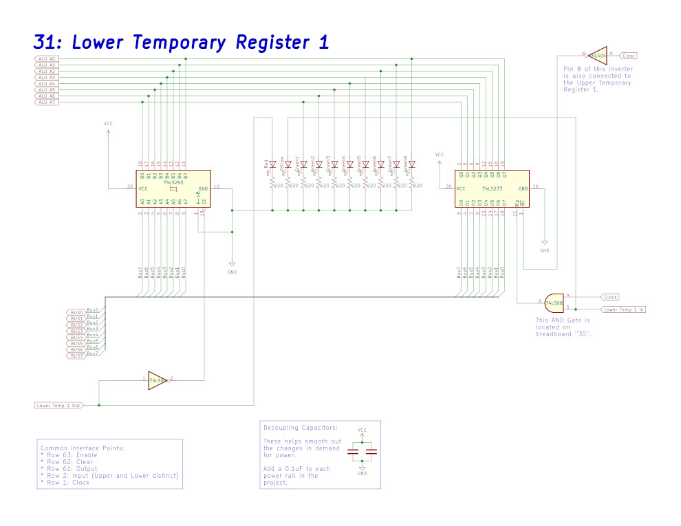

# Breadboard Computer v2

This project is related to building hardware more than a software project.  There will be some code added to this project later on for programming the firmware and downloading a program, but that will be in the final stages.

This project is inspired by [Ben Eater's Breadboard Computer](https://eater.net/8bit).  Currently as this get started, I have his computer nearly complete and I am working on the final connections and debugging before I get into the control logic.

As usual with my personal projects, I am compelled to keep a journal of this progress.  As usual with my journals, I will not go back and edit anything historical as these are my continuing thoughts rather than documentation of the final product.

## Temporary Register 1

This register is going to handle the upper part of the ALU calculations.  There are 2 inputs to the ALU which will be Temporary Register 1 and Temporary Register 0.

The key here is that the former A Register (documented so far in the [A-Register Journal](Journal-A-Register.md)) has been repurposed to be Temporary Register 1.  And now I have bugs to correct, which will be addressed from here.

### 2022-Feb-18

Somethings things just don't work out the way you want them to.  This bug is keeping me from properly testing and wiring up the ALU.  I guess I need to accept that it is better to have found this now rather than after the wire-up.

---

I need to start by figuring out where the problem is with the wiring.  I believe it is in the input from the bus, but I need to concretely confirm it.

Well, I was able to confirm it and I was able to get it cleaned up.  Now, at least the Lower Temporary Register 1 is working as it should.

---

### 2022-Feb-19

Well, I might have had to correct and then re-wired it to be incorrect last night.  I know I am certainly wiring things backwards at the moment.

Well, after some looking and re-wiring, it was correct.

---

OK, now the Upper Temporary Register 1 wiring is not correct.  I think it has the same problem as the Lower T1 had.  I got that worked out.

---

### 2022-Feb-20

This file has been renamed to represent its location in the overall computer.

---

I have the Upper Temporary Register 1 schematic completed.

... and through the magic of copy-and-paste, I have the Lower Temporary Register 1 schematic completed as well.

This, then, allows me to clean up the old folder (which will need to have its image moved).

Ahhhh....  I missed the connections to the actual ALU.  These will need to be added and the schematics re-published.