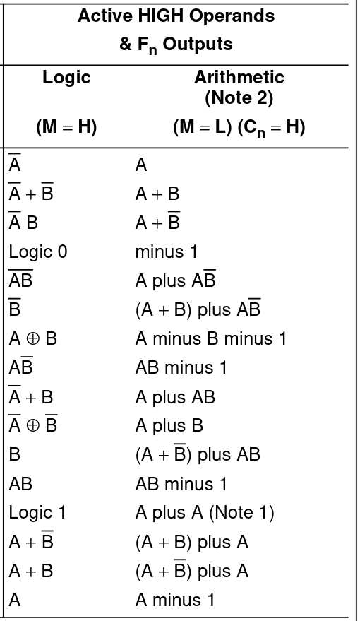

# Breadboard Computer v2

This project is related to building hardware more than a software project.  There will be some code added to this project later on for programming the firmware and downloading a program, but that will be in the final stages.

This project is inspired by [Ben Eater's Breadboard Computer](https://eater.net/8bit).  Currently as this get started, I have his computer nearly complete and I am working on the final connections and debugging before I get into the control logic.

As usual with my personal projects, I am compelled to keep a journal of this progress.  As usual with my journals, I will not go back and edit anything historical as these are my continuing thoughts rather than documentation of the final product.

## Arithmetic Logic Unit (ALU)

The ALU is used to perform lots of basic functions on the CPU.  It does..., well..., arithmetic and logic work.

Since I am going to need the ALU for memory management (and since I have abandoned the Memory Module and A Register for the time being), I am going to shift gears to the ALU.

---

### 2022-Feb-11

OK, this is going to take some work and analysis.  Not everything in the ALU documentation makes sense.

First there are 16 bitwise operations that can happen.  After seeing [this section](https://en.wikipedia.org/wiki/Bitwise_operation#Truth_table_for_all_binary_logical_operators), I vaguely remember them all.  There are some obscure ones.

Now, compare this to the 74LS181 data sheet, and these are the operations I should expect to be able to do:

There is a whole lot of what the huh???!?!!

To be clear, I am working with active-high values.  So, this means I need to have the carry-bit set to get my Arithmetic operations to work properly??!?!

The problem I have is that the 74LS181 data sheet does not properly document the logic functions.  Take NOR for example:

That really should have the bar over the whole expression since it is the inversion of an OR, not the inversion of A OR'd with the inversion of B (as the data sheet would imply).

But, through some experimenting with the 74LS181, I was able to confirm that the function was really NOR.

So, between the logical and arithmetic functions, here is what I want to support:
* NOT
* AND
* NAND
* OR
* NOR
* XOR
* XNOR
* FALSE (or 0)
* TRUE (or -1)
* ADD
* SUB
* SHL (Shift Left 1 position or multiply by 2)
* INC
* DEC
* NEG (really: 0 - A)

I also want to be able to support ADC and SBB if I can work it out.

So, time to make a table of the pin configuration for each operation:

| Oper  | S3 | S2 | S1 | S0 | M | Co | Inv |
|:-----:|:--:|:--:|:--:|:--:|:-:|:--:|:---:|
| NOT   | L  | L  | L  | L  | H | L  | x   |
| AND   | H  | L  | H  | H  | H | L  | x   |
| NAND  | L  | H  | L  | L  | H | L  | x   |
| OR    | H  | H  | H  | L  | H | L  | x   |
| NOR   | L  | L  | L  | H  | H | L  | x   |
| XOR   | L  | H  | H  | L  | H | L  | x   |
| XNOR  | H  | L  | L  | H  | H | L  | x   |
| FALSE | L  | L  | H  | H  | H | L  | x   |
| TRUE  | H  | H  | L  | L  | H | L  | x   |
| ADD   | H  | L  | L  | H  | L | H  | Inv |
| SUB   | L  | H  | H  | L  | L | L  | No  |
| SHL   | H  | H  | L  | L  | L | H  | Inv |
| INC   | L  | L  | L  | L  | L | L  | Inv |
| DEC   | H  | H  | H  | H  | L | H  | No  |
| ADC   | H  | L  | L  | L  | L | c' | Inv |
| SBB   | L  | H  | H  | L  | L | c  | No  |

That is 16 operations.  In the operation selection, there is a Carry-In component (making 32 distinctions) and a Carry-Out component driving the arithmetic.

So, if my inputs are 5 bits (4 control lines plus the carry flag) the output should be able to be the 6 bits above.  I should be able to handle that with an EEPROM.  That will actually work quite nicely.

I actually think I will need a control signal to invert the carry flag on output as well.  I have room for that so I will have no problem adding it.  So, that is 6 output bits.

So, this is all with a simple 4-bit ALU.  Next I will need to hook up a second one and attempt to perform the same functions with 2 ALUs.

---

### 2022-Feb-12

Once I started to hook up multiple ALUs, I ended up seeing the carry output behave properly.  So I may not need to invert that output.  I want to wire up the whole ALU to check again.

Now, the ALU is not dependent on the clock.  The ALU only has the output standard control line.  The other control lines will be the 4 control lines to select the ALU operation.

I do have 2 registers (both will be re-branded to be temporary registers) that are prepared for adding into the ALU.  I will only need to save room for the flags register.  I anticipate 2 boards for that.  But this is about the ALU.

The ALU is going to require 3 boards.  One for the upper ALU, one for the lower ALU, and one for the control logic.  I will need an inverter to handle the carry bit inversion and an AND gate to merge the `A=B` lines.  I think I can move the `A=B` merge onto the flags module.  So, that will leave an inverter and just the EEPROM for the control logic.

Ahh...!  But I also need to place a 74LS245 to control the output to the bus.  This also needs a control line.  This now makes things crowded and 3 board will be a requirement.

OK, here is the ALU "dry" layout.

Notice the empty space in the center board to the right-hand side?  That is for the EEPROM which I need to order.  I will order that on Monday (since they do not ship over the weekend) and should have that by Wednesday.

---

First up is the foundational wire-up.  To that, I will add 4 control lines to the center board for the function selection.

---

That completed, I now need to start wiring up the control lines.  The 2 output lines need to be inverted.

---

I was able to get the Lower Temp 2 Register (stand by for the story on that one) hooked up.  It is not right.  I'm going to have to do some tracing to see where things went wrong.  But, I really don't think I have that in me tonight.  It was in the 90s here today and I did some work outside.  I am beat and can't really think clearly.

---

### 2022-Feb-13

I actually figured out what I did wrong last night (away from the breadboards).  I hooked up the wires to the wrong pins (well, duh!).  I neglected to confirm which pins wer A pins and which were B pins, so I simply put them all in line.  Actually, they alternate A and B pins, so I have them crossed.  This should be trivial to confirm.

In the picture, you cal clearly see that pins 21 & 22 are both hooked up (pin 23 is also hooked up but under the other wires in this photo), and should not be since I was only wiring up the B pins.

A quick adjustment and the "B calculation" result is passed along to the ALU output.

---

Well, I just realized that I am going to run out of green hook-up wire before I get the ALU wired up.  This is going to suck as I will need green wire for any module I want to work on if I am going to stick with my wire-theming.

---

After getting the Temp 1 Lower wired-up with temp jumpers, I was able to confirm that that table appears to be correct at least for 8-bits.

---

I think I am going to move the 74LS04 and 74LS08 chips over to make room for a second EEPROM IC -- just in case I want to add some additional actions (most likely which flags will be updated by any given operation).

---

### 2022-Feb-14

OK, I got my supplies order out today.  I hope to have it by Wednesday.

In the meantime, I am working on how to determine equality.  The 74LS181 is supposed to have an `A=B` pin, but I am not able to determine what that is all about.  Even the schematic does not make sense.

So, my thought is to check the ALU output (all 16-bits) to see if they are all 0.  This will allow me to create opcodes like CMP which will do the subtraction but not update any registers and TEST which will do an AND but not update any registers.

To do this check a NOR gate will work well to compare pairs of bits.  I will need 8 gates to compare 16 bits, which is on 2 74LS02 chips.  Then all 8 outputs will need to be ANDed together (another 7 AND gates or 2 74LS08 chips) to get the final Zero Flag output.

On top of this, I need to control the inversion of the Carry Flag which will be controlled in the ALU Control Code.  And I have not even started to figure out < or > logic and store those bits.  However, the ALU is slowly getting bit enough to warrant considering moving that to a third column of boards in the overall layout and to "bridge" the bus between them.

So, taking into account what I might have built already, what could this look like?

| Left Column | Center Column | Right Column |
|:-----------:|:-------------:|:------------:|
| Clock Module | Upper Program Counter | Upper Temp 1 Register |
| Upper MAR | Lower Program Counter | Lower Temp 1 Register |
| Lower MAR | Upper Flags | Upper ALU |
| Upper RAM | Lower Flags | Lower ALU |
| Lower RAM | Upper Stack | Upper Temp 2 Register |
| Upper A Register| Lower Stack | Lower Temp 2 Register |
| Lower A Register | Bus Bridge | ALU Control 1 |
| Upper B Register | Bus Contents | ALU Control 2 |
| Lower B Register | CPU Constants | Control Logic 1|
| Upper X Register | Upper Output | Control Logic 2|
| Lower X Register | Center Output | Control Logic 3|
| Reset Logic | Lower Output | Control Logic 4 |

A couple of things I like about this layout better:
1. The flags register is actually closer to the ALU, which will be driving the flag updates.
2. The computer feels more square meaning I should not have to stretch too far to wire things up (or stand to do it for that matter).
3. This layout will work better with the size of the board I am building on (really just a side benefit).
4. Overall, this will modularize the ALU and is being treated more like a micro-controller than anything.
5. The bus bridge is about the same width as width as a breadboard without the rails, so it will be easy to integrate.

This, then brings me back to the ALU Control Logic.  I need room for:
* 1 74LS04 Inverter
* 2 74LS30 Quad 2-Input NOR Gates
* 3 74LS08 Quad 2-Input AND Gates
* 2 28C16 EEPROMs

This is 8 ICs on 2 boards.  It will be tight, but still doable.

Now to tackle this whole Carry Flag inversion mess:

| Carry In | Invert | Carry Out |
|:--------:|:------:|:---------:|
|    0     |    0   |     0     |
|    0     |    1   |     1     |
|    1     |    0   |     1     |
|    1     |    1   |     0     |

Well, that looks like a simple XOR gate and I should be able to replace one of the Quad AND Gates with an XOR Gate and handle that a little better.

So, I am down to 7 AND gates, 1 XOR gate, and 8 NOR gates.  I also need 2 Inverters.

Now, the next step is to plan how to separate the ALU from what has already been built.  More to the point, how to separate Temp Register 1 and the ALU from the rest of what has been built.  That sounds easier than it really will be.  I will also need to collapse the ALU and separate out the ALU Control Logic.

I'm almost starting over, but not quite.

---

Well, I feel like I just took apart and reassembled Frankenstein's monster.  Lots of little things needed to be removed, relocated and reconnected.

That said, I have a fully assembled ALU module (well, the breadboard are all physically connected).  The next problem is that it will not fit on the board anymore.  I will have to find something bigger.

I know Home Depot has 1" rigid foam insulation; I just need to make sure it will be the correct size.

OK, so now what?  I do not have everything I need to wire-up the ALU.  I do know I want to re-route many of my current connections.

---

### 2022-Feb-16

Late last night and so far this evening, I have been working on wiring up the ALU outputs to the LED lights and the 74LS245 Buffer.  I managed to get all the control lines routed together.  I also have the output common control lines routed to the ALU Control Board and then back up to the 74LS245 to enable the output.

I am basically killing time until I get my supplies order -- on Saturday!  Grrrr....

Now, on the other hand, I could probably start the firmware component which will drive the ALU Control Logic.  This is going to be written in and maintained in the Arduino IDE, but will be a directory in this project.

---

### 2022-Feb-18

OK, I did find a problem with the DEC functionality.  It was corrected and I think I have it working now for 1 bit.

I had several problems with the ALU wired wrong.  All of those have been corrected as well.

So, now I am left with a mess of wires to replace with wires that are cut to length.

Trust me: the picture does not do it justice.

---

### 2022-Feb-19

Well, I wired up half the Lower ALU today and then realized I have it all backwards again.  I may have even had the Lower Temporary Register 1 correct yesterday before I changed it.

My problem appears to be the inability to distinguish between the most significant bit and the least significant bit properly.

I'm starting to get annoyed about the whole situation.

---

I need to stop second-guessing myself.  I pulled it all apart to realize that it was correct.

---

A quick code change for the ALU Controller EEPROM and the actual ALU is complete.  The only thing left are the gates to handle the flags analysis prior to handing them off to the flags register.

So, there are a few orange and yellow jumpers on the right side, which are used for loading the Temporary Registers.  There are 2 single (blue and green) jumpers in the center of the left of the module which were used for testing to disable the output from the ALU.  Finally, all the remaining multi-colored jumpers along the left are for connecting to the bus, and will be cleaned up once I have a bus to connect to.

Finally, along the bottom are the logic gates I will need to complete the analysis for the flags.  I just need to decide which flags I will be doing.

In the meantime, it is time to commit this work.

---

### 2022-Feb-21

I moved several paragraphs from this Journal to the ALU Controller Journal.  This was done in the interest of the computer layout, aligning this Journal specifically with the ALU which resided between the 2 Temporary Registers.

At the same time, this Journal file will be renamed as well to align to the naming.

---

### 2022-Feb-23

Completing the ALU schematics today:

... and:

I was also able to complete the ALU Control Board:

---

### 2022-Feb-25

Today, I wrapped up the ALU schematics.  Board "38"
remains empty and I am not planning to write a schematic for an empty board.

This should actually wrap up the ALU.  Until I find something I need to change.  Time to commit these changes.

