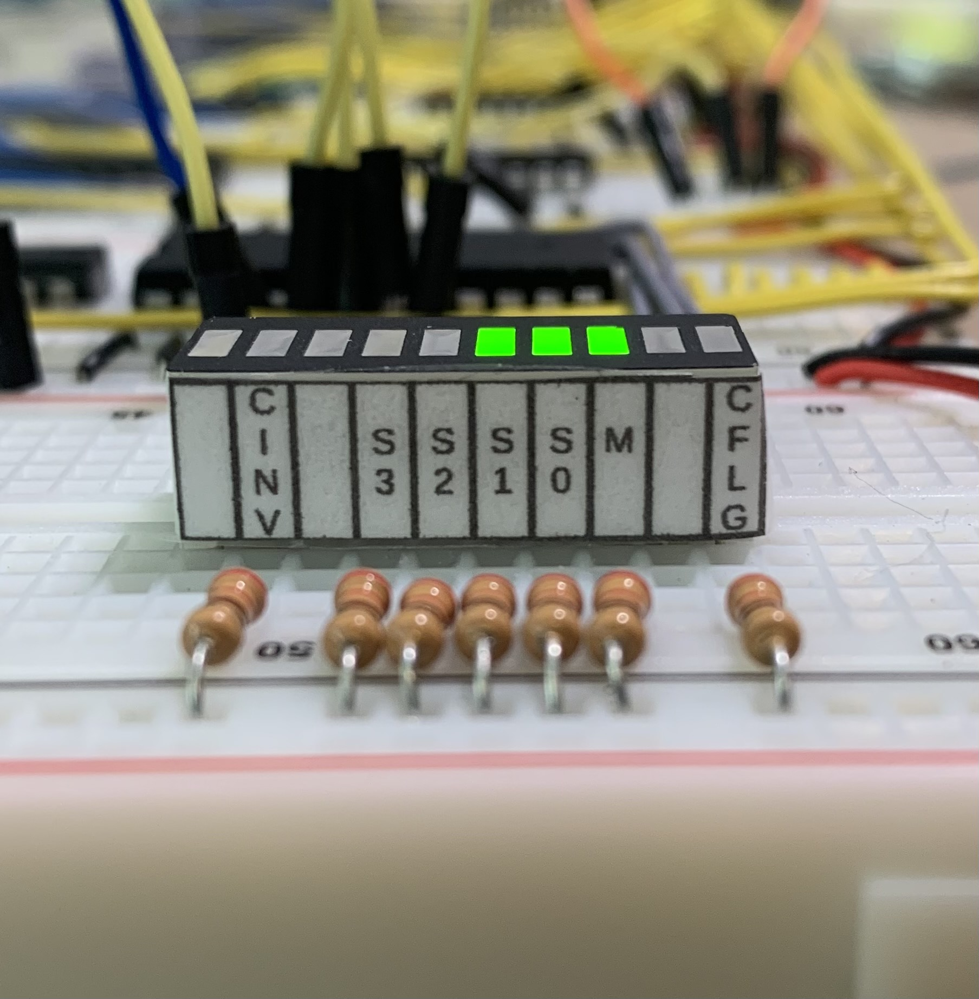
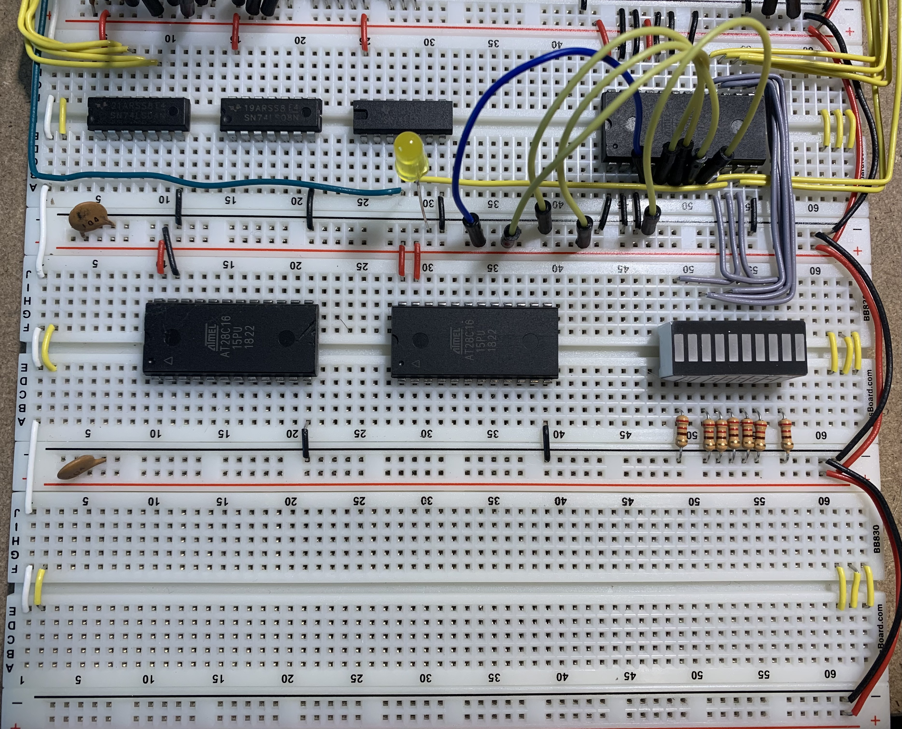
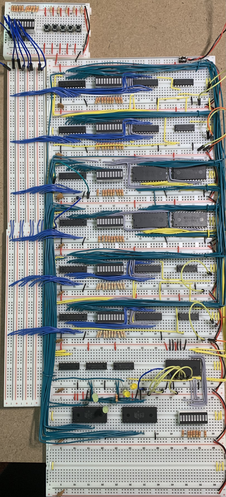

# Breadboard Computer v2

This project is related to building hardware more than a software project.  There will be some code added to this project later on for programming the firmware and downloading a program, but that will be in the final stages.

This project is inspired by [Ben Eater's Breadboard Computer](https://eater.net/8bit).  Currently as this get started, I have his computer nearly complete and I am working on the final connections and debugging before I get into the control logic.

As usual with my personal projects, I am compelled to keep a journal of this progress.  As usual with my journals, I will not go back and edit anything historical as these are my continuing thoughts rather than documentation of the final product.

## Arithmetic Logic Unit (ALU) Control Logic

In the interest of full disclosure, I actually split this section off of the ALU Journal and moved notes out of that Journal into this one.  The reason for this is that the ALU Control Logic Module resides below the Temporary Register 2 and with the new module naming it makes more sense to have this module as its own section.

However, I have not *changed* the content, just relocated some of it.

---

### 2022-Feb-16

I could probably start the firmware component which will drive the ALU Control Logic.  This is going to be written in and maintained in the Arduino IDE, but will be a directory in this project.

This Arduino sketch will take advantage of the code I wrote to program other EEPROMS.  Let me get that established.

---

### 2022-Feb-17

Well, I was able to complete writing the EEPROM programmer and I actually received the EEPROMs today (not Saturday), so I have something I can work with.

That said, I have not yet tested the EEPROM.  I did use all 8-bits of the EEPROM output, so I have nothing left to latch the flags.  However, I think that will be easy to handle by latching all flags on any ALU operations (they all should be updated).  There is no enable on the ALU (it always does something).  So, the Flags Latch control line will have to be the thing that enables the flags update.

All-in-all, I think it was a good day as I have the supplies I need to complete the ALU module, the software written for the ALU Control, and the weekend coming up to be able to debug the whole shebang.

In the meantime, I have a few wires to run....  Tomorrow.

---

### 2022-Feb-18

Today I was able to test the EEPROM flags that were being set.  I was able to find and resolve a couple bugs before I ever got the registers hooked up.

I also decided to add some LEDs to see what control bits the ALU Controller is sending to the ALUs themselves.

And then I was able to get them labeled.

The alignment is not dead perfect, but I am not going to let that bother me.  From left to right:
* Invert Carry Flag before Latching
* S3 Control Line
* S2 Control Line
* S1 Control Line
* S0 Control Line
* M Control Line
* Carry Flag Input

---

Well, I just realized the Lower Temp Register 1 is wired backwards, such that the most significant bit from the bus is wired to the least significant in the register.

I thought I could work around this problem but it is totally backward.  I am going to have to correct it before I do anything more with the ALU.

---

### 2022-Feb-19

I am seeing the Carry Flag is not working properly, but I am only testing with 8 bits so far.  The bits that I am loading for testing are:

* T1: 1010 1100
* T2: 1100 1010

This pattern should provide all 4 conditions that need to be considered in a predictable pattern, and then reversed.

So, with that said the following should be my 8-bit test results (which I need to ignore the carry bit for now):

| ## | Operation | T1 | T2 |  Results  |
|:--:|:----------|:--:|:--:|:---------:|
|  0 | NOT       | Y  |    | 0101 0011 |
|  1 | AND       | Y  | Y  | 1000 1000 |
|  2 | NAND      | Y  | Y  | 0111 0111 |
|  3 | OR        | Y  | Y  | 1110 1110 |
|  4 | NOR       | Y  | Y  | 0001 0001 |
|  5 | XOR       | Y  | Y  | 0110 0110 |
|  6 | XNOR      | Y  | Y  | 1001 1001 |
|  7 | FALSE     |    |    | 0000 0000 |
|  8 | TRUE      |    |    | 1111 1111 |
|  9 | ADD       | Y  | Y  | 0111 0110 |
| 10 | SUB       | Y  | Y  | 1110 0010 |
| 11 | SHL       | Y  |    | 0101 1000 |
| 12 | INC       | Y  |    | 1010 1101 |
| 13 | DEC       | Y  |    | 1010 1011 |
| 14 | ADC (0)   | Y  | Y  | 0111 0110 |
| 14 | ADC (1)   | Y  | Y  | 0111 0111 |
| 15 | SBB (0)   | Y  | Y  | 1110 0010 |
| 15 | SBB (1)   | Y  | Y  | 1110 0001 |

I did manage to find and correct a problem with the ADC logic in the EEPROM.

---

After correcting a problem with the Upper Temporary Register 1, I have everything wired up and I am ready to test again.  So once again, I need to set up my test scenarios -- this time for 16-bits.

* T1: 1010 1100 0011 0101
* T2: 1100 1010 0101 0011

| ## | Operation | T1 | T2 | C |   Expected Results  |
|:--:|:----------|:--:|:--:|:-:|:-------------------:|
|  0 | NOT       | Y  |    | N | 0101 0011 1100 1010 |
|  1 | AND       | Y  | Y  | N | 1000 1000 0001 0001 |
|  2 | NAND      | Y  | Y  | N | 0111 0111 1110 1110 |
|  3 | OR        | Y  | Y  | N | 1110 1110 0111 0111 |
|  4 | NOR       | Y  | Y  | N | 0001 0001 1000 1000 |
|  5 | XOR       | Y  | Y  | N | 0110 0110 0110 0110 |
|  6 | XNOR      | Y  | Y  | N | 1001 1001 1001 1001 |
|  7 | FALSE     |    |    | N | 0000 0000 0000 0000 |
|  8 | TRUE      |    |    | N | 1111 1111 1111 1111 |
|  9 | ADD       | Y  | Y  | Y | 0111 0110 1000 1000 |
| 10 | SUB       | Y  | Y  | Y | 1110 0001 1110 0010 |
| 11 | SHL       | Y  |    | Y | 0101 1000 0110 1010 |
| 12 | INC       | Y  |    | N | 1010 1100 0011 0110 |
| 13 | DEC       | Y  |    | N | 1010 1100 0011 0100 |
| 14 | ADC (0)   | Y  | Y  | Y | 0111 0110 1000 1000 |
| 14 | ADC (1)   | Y  | Y  | Y | 0111 0110 1000 1001 |
| 15 | SBB (0)   | Y  | Y  | Y | 1110 0001 1110 0010 |
| 15 | SBB (1)   | Y  | Y  | Y | 1110 0001 1110 0001 |

OK, so I have carry problems to sort out already for the following logic operations:
* NOT
* NAND
* NOR
* XOR

A quick code change for the ALU Controller EEPROM and the actual ALU is complete.  The only thing left are the gates to handle the flags analysis prior to handing them off to the flags register.

---

### 2022-Feb-20

This morning, I will start by consolidating the `Z` and the `P` flags for the flags register.  For this, I have 8 ICs on the module, 1 of which I know to be a 74LS04 Hex Inverter and another I know to be a Quad-XOR gate (I do not recall the IC number off the top of my head this morning).

So the layout looks something like this:

<table>
    <tr>
        <td>74LS02 - Quad NOR Gate</td>
        <td>74LS02 - Quad NOR Gate</td>
        <td>74LS86 - Quad XOR Gate</td>
        <td>74LS86 - Quad XOR Gate</td>
    </tr>
    <tr>
        <td>74LS04 - Hex Inverter</td>
        <td>74LS08 - Quad AND Gate</td>
        <td>74LS08 - Quad AND Gate</td>
        <td>74LS86 - Quad XOR Gate</td>
    </tr>
</table>

Most of this is for the Parity (`P`) and the Zero (`Z`) flags.  The Carry (`C`) flag also uses this logic but is already evaluated and ready to route off-module.

For the `Z` flag, each ALU result bit will be NOR'd with its neighbor, such that the result is high when both inputs are low (or `0`).  I have 16 ALU bits, so I need 8 NOR gates to perform these comparisons.  Then those 8 results all need to be AND'd together to get a single result -- which is the `Z` flag.

For the `P` flag, each of the same ALU result bits will be XOR'd with its neighbor such that the result is high when there is an *odd* parity between them.  Each of those 8 outputs will be XOR'd together into 4 outputs, each of which will be high if there is still *odd* parity between them.

Think about it: given input `0101`, the results will be `11` at the first set of gates and then `0` at the second (the original input was even parity already).  Also given input `1101`, the results are `01` and then `1` (the original input was odd parity and the `P` flag needs to be set to make the result even parity).

So, those 4 outputs from the prior level need to be XOR'd together to 2 results, then those 2 XOR'd together for the single `P` flag.

That means I need:
* 8 NOR gates (2 ICs)
* 7 AND gates (2 ICs)
* 15 XOR gates (4 ICs)

I do not have all the room I need; I am missing a 74LS86 Quad-XOR Gate to make this work.

I can move things over and make room, but the connections are going to be quite dense.

Let me go think in the other flags a bit.

So, it makes sense to add another row of boards.  Let me get that done.

So, with the additional board, the layout looks something like this:

<table>
    <tr>
        <td>74LS02 - Quad NOR Gate</td>
        <td>74LS02 - Quad NOR Gate</td>
        <td>74LS86 - Quad XOR Gate</td>
    </tr>
    <tr>
        <td>74LS04 - Hex Inverter</td>
        <td>74LS08 - Quad AND Gate</td>
        <td>74LS08 - Quad AND Gate</td>
    </tr>
    <tr>
        <td>74LS86 - Quad XOR Gate</td>
        <td>74LS86 - Quad XOR Gate</td>
        <td>74LS86 - Quad XOR Gate</td>
    </tr>
</table>

What the hell am I doing??!!

I can take care of all this with a second & third EEPROM and AND the results together.  Maybe one larger EEPROM if I look a little bit.

I think I can get away with 2 of the 28C16 EEPROM -- 1 for each byte and then AND the 2 results together.  Well, hang on.  I would be able to AND the 2 `Z` results together and then XOR the 2 `P` results together.  I already have an XOR gate, so there is no concern there.  I would just need to move an AND gate up to to the top ALU Control to make room for the 2 EEPROM.

Now, can I incorporate the logic for the `V` Flag?  I could but it will be an additional EEPROM.  So, I am going to actually leave the layout the way it is and just have an empty board.

---

After walking away for a bit, I reconsidered the `V` Flag.  It would only take an additional 2 address lines for the `A15` and `B15` inputs.  I already have `ALU15`.  So, with 2 28C16 EEPROMs, I would need:
* Address lines 0-7 for 8 bits of ALU results
* Address line 8 for selecting lower/upper ALU byte
* Address lines 9-10 for A7 and B7 inputs (tied low for the lower byte)

For the lower byte, the `V` output would be low and would be ignored.

With that, I think I have what I need to get started writing the firmware for this now.

---

That was actually an easy sketch to write.  I am ready to program both EEPROMs when I get them wired up.

Here are the ALU Control Logic boards at the moment:

The first thing I need to do is wire up the AND gates for the `Z` Flag.

Before I do that, I think I want to change what pins I use for the flag output.  I originally set those to be 0-2, but those are on the bottom of the EEPROM and the wire-up is not convenient.  If I move them to be 5-7, it will work out better.

---

OK, I am all wired up.  I also have programmed and surface tested the EEPROM.

I have 2 sets of bus rails which are prepared and ready for wire-up as well.  Once that is complete, it should largely complete the ALU.

---

Here is the completed ALU.  The only things left are to hook it up to the control logic and to hook it up to the flags register.

I will commit my work again today at this point.  I have a number of schematics to draw and I am planning on changing the schematics to generally 1 per board.

You know, I really need to call out that this is not only the ALU but 2 16-bit Temporary Registers as well.  These 2 registers are used as inputs to the ALU and can be used for other things in the CPU (such as constructing an address when an address is being used as a base-reference point to build the address).

So, top to bottom to the right of the bus:
1. Upper Temporary Register 1
2. Lower Temporary Register 1
3. Upper ALU
4. Lower ALU
5. Upper Temporary Register 2
6. Lower Temporary Register 2
7. ALU Control firmware
8. ALU Flags firmware
9. Empty

