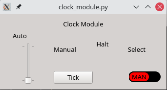
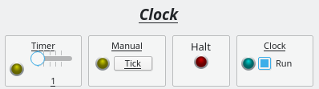
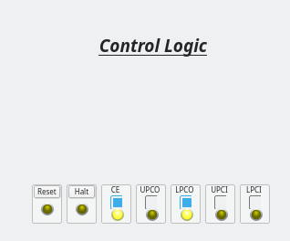

# Breadboard Computer v2

This project is related to building hardware more than a software project.  There will be some code added to this project later on for programming the firmware and downloading a program, but that will be in the final stages.

This project is inspired by [Ben Eater's Breadboard Computer](https://eater.net/8bit).  Currently as this get started, I have his computer nearly complete and I am working on the final connections and debugging before I get into the control logic.

As usual with my personal projects, I am compelled to keep a journal of this progress.  As usual with my journals, I will not go back and edit anything historical as these are my continuing thoughts rather than documentation of the final product.

## Computer Emulator

This journal documents the journey I take to implement an emulator for the computer I am building.  This emulator will faithfully reproduce how the real computer behaves.

---

### 2022-Feb-28

Well, I have quite a bit of ADD lately.  I am going to start to kick around building out an emulator.  I do not expect to have much to add to the repo for a while, and in fact I am going to explicitly ignore the source when checking things in for a while.

I am working determining a framework and language for this development.  For the moment, I am working on Qt6 for the framework and Python3 for the language.  To solidify my choices, I will be doing some testing -- likely to build out an emulated clock module.

---

### 2022-Mar-03

Well, I have been playing around a bit with the Python code for the emulator.  I am getting some things done, which is nice.

First, there is something with PyQt6 which is not really working the way I want it to.  I am reverted back to PyQt5, which seems a little more solid at the moment.

I was also able to get a rudimentary timer timer working to the point I can manually (via changing code) set a timer frequency.  None of this was done on this computer, though.  So, I want to work on getting this code settled into this project.  It's kinda dead-head stuff at the moment, so it is nice for me to work on it while I let the last wire-up job bake in my head.

The first order of business is to get the LED working properly.  I have a round one nearly complete, so I will work on getting that moved over.

I was also able to pull a sliding switch object from stack overflow.  So, that piece is set to work as well.

So, I should have nearly everything I need to get the clock module assembled, which I can work on over the next few days.

---

### 2022-Mar-04

Today, I was able to get the basic layout completed for the clock module.  Not everything is displayed yet, but it is workable.

The next thing is going to be to figure out how to wire up the signals and slots.

---

I am having problems with the updates from the clock signal to the LED.  Python is seg-faulting when I try to change the frequency.  I believe this is a problem with the design and needing to get signals and slots working properly.  Not starting the thread solves the problem.

---

### 2022-Mar-05

I think I need to get a label which shows the current clock speed setting.  It will be a good way to play with signals and slots before I get into the task running again.

Well, I have the actual clock running, with a selectable frequency from 1 to 25 Hz.  Not bad for this emulator.  It is able to step by single (1 Hz) increments.

The next thing will be to set up the manual single-step clock to work.  After that, I will have to set the final clock output to be handled properly.

---

### 2022-Mar-07

Well, I gave up on the Python Qt code and deleted it in total.  I am going to work with a C++ version with Qt6.  It is coming together far faster with their tools and so far I am writing very little code.  I will need to figure out how to merge the code from a separate VM into this base where they are not allowed on the same network.

---

### 2022-Mar-11

I think I am going to work on some of the low-level components I need for the emulator.  Specifically, I think I will work on getting the round LED working such that I can use it in Qt Designer -- which would be nice.

OK, I need nothing on the LED widgets for the emulator; there is an LED already included in QtCreator!  So, I only need to be concerned with the slider if I am going to use that.  I can also use just a checkbox to accomplish the same thing.  So, I should be good.

---

I have the layout of the emulator established.  The clock module is laid out:

Before I get too much farther, I need to establish some back-end threads for handling the different conditions.  For example, the Timer LED needs to flash no matter what; the Manual LED needs to come on for about half a second and then go back out.  And the clock LED needs to be triggered on either of the other 2, but also needs to be conditioned on the value of the Run checkbox.

This probably means I am going to need to subclass several of these sections or perhaps just have a background class which manages all this.

While I think about this, I will work on the hardware.

---

### 2022-Mar-13

I got the clock module completed in the emulator.  It actually works well.  The only limitation is the speed of the clock, which is capped at 25Hz in the emulator.

I actually believe this is enough of a change that I should commit the code even if I do not have the proper documentation on what needs to be installed.

---

### 2022-Mar-14

It occurs to me that I really need to get parts of the control module set up so that I can simulate actions and test things out as I go.  This will emulate what I have going on with the physical build as well.  At some point, I will need to work out exactly how to have 1 set of binary data which will write to both the EEPROM and be used by the emulator -- when you have 2 masters, 1 is guaranteed to be wrong!

Anyway, the control module really should be started to get some things working like the real world.

---

I was able to get all kinds of stuff done today.  I was able to get several control signals built:

I was able to get a program counter working properly (and I believe it is complete):

Finally, I was able to also get a bus set up so I can pass data back and forth:

All-in-all, things were rather productive today!

---

### 2022-Mar-15

Today I was able to get the Temporary Register 1 and 2 both working today.  I was also able to create a more generic register from which each register is sub-classed.

I currently have a problem whereby I am creating a class (not just an object, but a separate class) for each register.  I could clean that up, but my intent is not to write the cleanest code here.

Instead, my intent is to get an emulator working so I can write the BASIC code and start testing that out on an emulator before committing it to the hardware.

